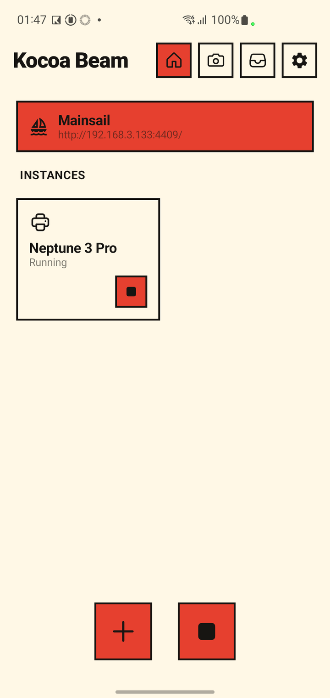
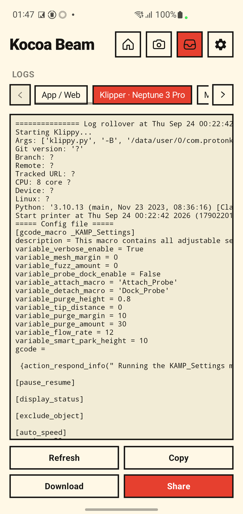
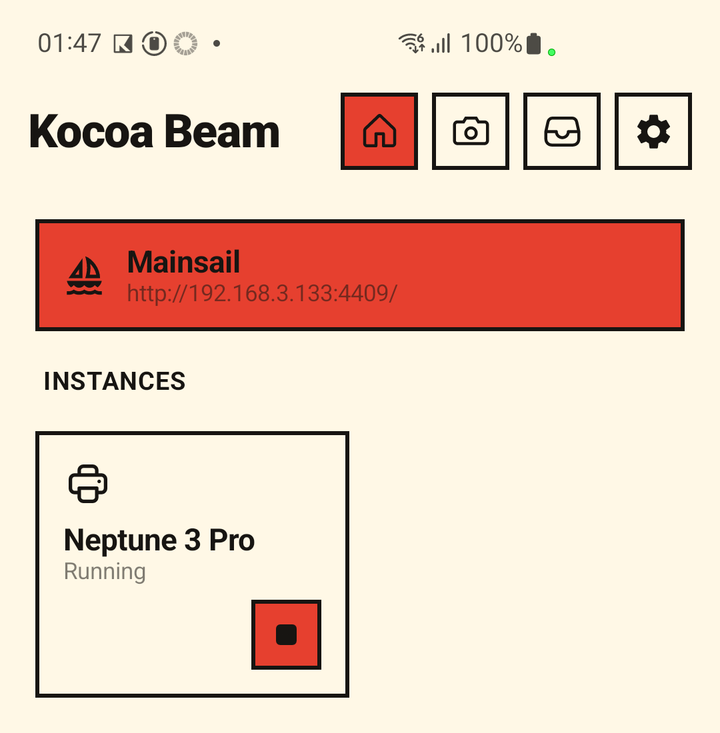
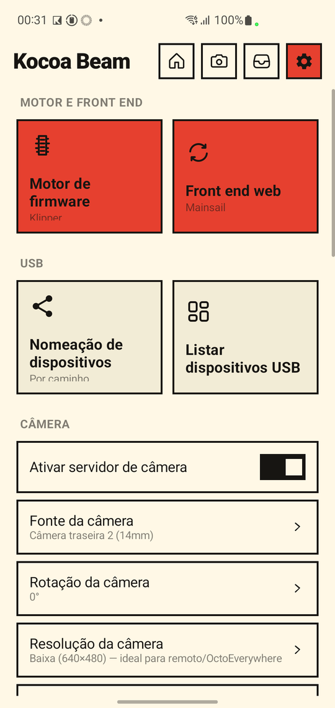
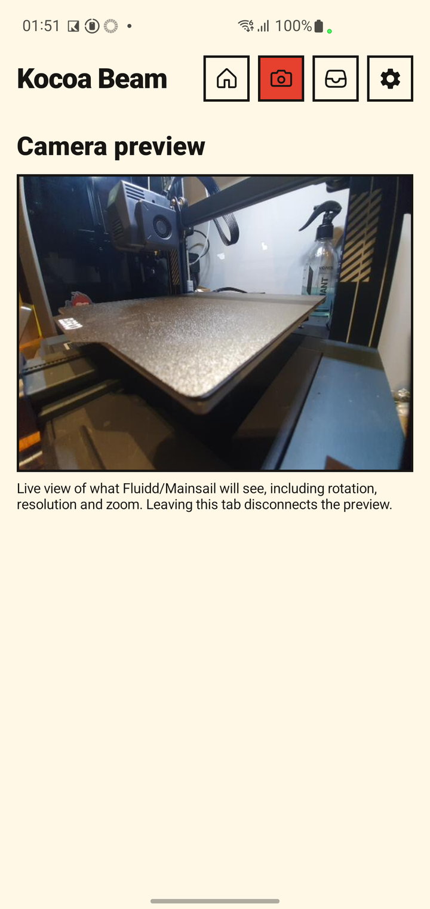
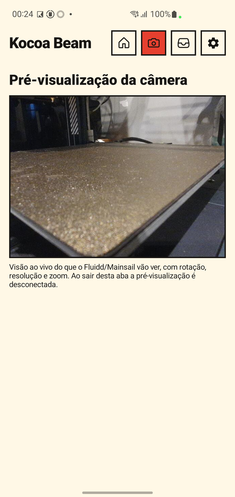
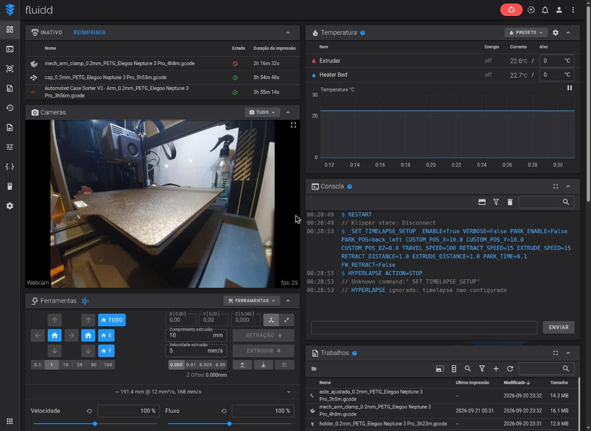
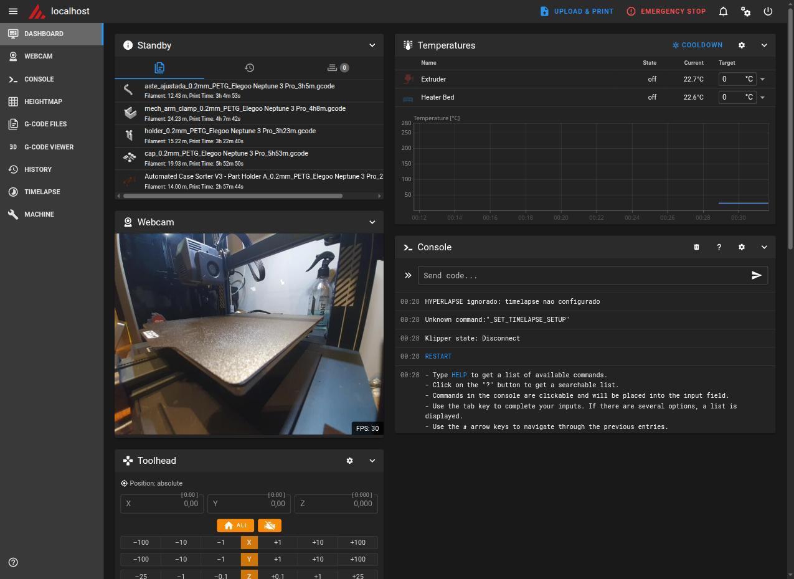
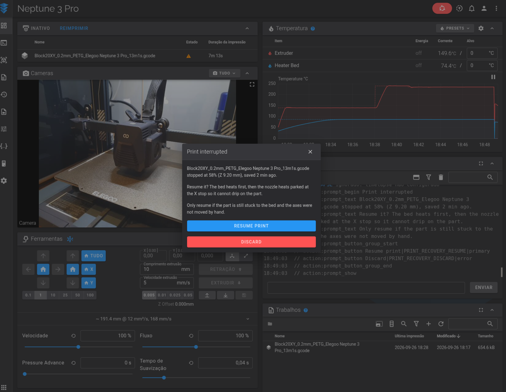

# Kocoa Beam - Klipper for Android

  
  
  
  

**Read this in other languages: [English](README.md) · [Português (BR)](README.pt-br.md) · [简体中文](README.zh-Hans.md) · [繁體中文](README.zh-Hant.md)**

  
  

> **Just want to install it?** Grab the latest APK from the
> [Releases page](https://github.com/Brozinga/Kocoa-Beam/releases/latest) — if
> you're not sure which one, pick `armv7` (see
> [Choosing the Right Package](#choosing-the-right-package) below).

<strong>📑 Table of contents</strong>

- [What's in a Name?](#whats-in-a-name)
- [Why Kocoa Beam?](#why-kocoa-beam)
- [What this project changes](#what-this-project-changes)
- [Choosing the Right Package](#choosing-the-right-package)
- [Quick Start](#quick-start)
- [Screenshots](#screenshots)
- [Documentation](#documentation)
- [What's IP:port?](#whats-ipport)
- [What's inside?](#whats-inside)
- [Updates](#updates)
- [Android Extensions](#android-extensions)
- [Autostart](#autostart)
- [Background Activity Notice](#background-activity-notice)
- [Android TV Support?](#android-tv-support)
- [What USB Hub to Use?](#what-usb-hub-to-use)
- [Restrictions](#restrictions)
- [Building](#building)
- [Credits](#credits)
- [Contributing](#contributing)

## What's in a Name?

**Kocoa Beam** is named after cocoa beans — the smooth, rich foundation of chocolate. Like cocoa beans transformed into something warm and delightful, Kocoa Beam takes the raw energy of [Beam Klipper](https://github.com/utkabobr/BeamKlipper) and refines it into a softer, sweeter experience.

The "K" honors our Kotlin roots and Klipper heritage. The "Beam" pays tribute to the original [Beam Klipper](https://github.com/utkabobr/BeamKlipper) by [ProtonKicker](https://github.com/ProtonKicker). Together, it's a name that's as warm and approachable as a cup of hot cocoa.

Kocoa Beam allows you to run [Klipper](https://github.com/KevinOConnor/klipper) or [Kalico](https://github.com/KalicoDTU/kalico) host software on any Android 5.0+ device with OTG support.

## Why Kocoa Beam?

Kocoa Beam is a complete overhaul of Beam Klipper with three major improvements:

### 1. Kotlin Rewrite
The entire application has been migrated from Java to Kotlin, bringing:
- **Null safety** — compile-time prevention of NullPointerExceptions
- **Coroutines** — automatic cleanup of background threads, no more leaks
- **Immutable data classes** — thread-safe event bus messages and database entities
- **Smart casts & exhaustiveness checks** — bugs caught at compile time, not runtime

### 2. Dramatically Smaller Size
Kocoa Beam is significantly smaller than the original Beam Klipper:

| Component | Beam Klipper | Kocoa Beam |
|-----------|-------------|------------|
| FFmpeg timelapse | Bundled binary (~40 MB) | Android MediaCodec API (built-in) |
| App size | ~138 MB (arm64) | ~38 MB (arm64 / armv7), ~41 MB (x86_64) |

The FFmpeg timelapse component was replaced with Android's native MediaCodec API, saving ~40 MB per architecture.

### 3. Brand New UI
Kocoa Beam features a complete UI redesign with:
- Brutalist bento-box aesthetic with "Paper/Honey/Ink" color palette
- Hard offset shadows and bold borders
- Modern Jetpack Compose implementation
- Improved layout and usability

## What this project changes

Everything added or fixed on top of Beam Klipper (details in the linked guides):

**Platform & interface**
- [x] Kotlin rewrite
- [x] Brand new UI
- [x] 10 concurrent printer instances
- [x] Klipper and Kalico firmware engines
- [x] Local-only operation (Beam Cloud removed)
- [x] Brazilian Portuguese app language
- [x] In-app Logs tab
- [x] Crash log
- [x] Separate web port per front end

**Bundled software**
- [x] Support Klipper 0.13 — [`build-firmware.md`](docs/build-firmware.md)
- [x] Update Moonraker (0.11.0)
- [x] Update Fluidd (1.37.5)
- [x] Update Mainsail (2.19.0)
- [x] Update Happy Hare (v4.0.0)
- [x] Add Voyager UI as a third web front end
- [x] Klipper add-ons: KAMP, LED Effect, Z Calibration, Auto Speed, TMC Autotune — [`mods/klipper-addons.md`](docs/mods/klipper-addons.md)
- [x] Input shaper without an accelerometer — [`mods/input-shaper-manual.md`](docs/mods/input-shaper-manual.md)
- [x] Starting `printer.cfg` template and printer profiles — [`getting-started.md`](docs/getting-started.md)
- [x] MCU firmware build tooling (Docker and local script) — [`build-firmware.md`](docs/build-firmware.md)

**Features**
- [x] Native timelapse (MediaCodec instead of FFmpeg) — [`timelapse.md`](docs/timelapse.md)
- [x] USB webcam support, camera resolution and rotation — [`webcam.md`](docs/webcam.md)
- [x] Live camera preview, zoom and tap to focus — [`webcam.md`](docs/webcam.md)
- [x] Streaming stability on weak WiFi — [`webcam.md`](docs/webcam.md)
- [x] Print recovery after a power loss — [`print-recovery.md`](docs/print-recovery.md)
- [x] Add OctoEverywhere remote access — [`octoeverywhere.md`](docs/octoeverywhere.md)
- [x] Add Obico remote access — [`obico.md`](docs/obico.md)

**Fixes**
- [x] Fix timelapse rendering — [`timelapse.md`](docs/timelapse.md)
- [x] Fix G-code metadata and thumbnails
- [x] Fix Fluidd/Mainsail static assets (MIME types)
- [x] Fix Klipper macros running as no-ops
- [x] Fix Klipper start-up abort on stock `[mcu]` options

## Choosing the Right Package

Kocoa Beam provides three APK variants:

| Architecture | Package Name | Use Case |
|-------------|--------------|----------|
| arm64 | `KocoaBeam_*_arm64.apk` | Modern 64-bit devices |
| armv7 | `KocoaBeam_*_armv7.apk` | Older 32-bit devices — works on most devices (recommended if unsure) |
| x86_64 | `KocoaBeam_*_amd64.apk` | x86_64 tablets, Chromebooks, Android emulators |

**How to check your device architecture:**
- **Settings > About Phone > Architecture** or **Kernel Architecture**
- Or install a CPU info app like "CPU-Z" or "AIDA64"
- If unsure, pick armv7 — it is the package that works on the widest range of devices

## Quick Start

**Start here: [`docs/getting-started.md`](docs/getting-started.md)** — the
illustrated step-by-step guide for installing Kocoa Beam and running it for the
first time (APK, first printer, MCU firmware, opening the web interface).

> **Stuck?** The in-app **Logs** tab (screenshot above) shows the Klipper,
> Moonraker and app logs, and lets you copy/share them without a PC — handy if
> something doesn't work as expected.

## Screenshots

**On the phone/tablet**

| Main screen | Settings | Live camera preview | Zoom (2×) |
|:-:|:-:|:-:|:-:|
|  |  |  |  |
| Start/stop printers; shows the web address | Firmware engine, web front end, USB, camera, remote access, language | New tab: see what the camera sees | Zoom levels offered depend on the selected camera |

**In the browser** — the web interfaces are served by the device itself, with the printer connected and the webcam live:

  
  

Fluidd (left) and Mainsail (right)

**Print recovery** — after a power loss, Fluidd and Mainsail offer to resume the print ([guide](docs/print-recovery.md)):

The in-app **Logs** tab is shown at the top of this page.

## Documentation

Everything below is in [`docs/`](docs/index.md) (also available in Português and 简体中文):

| I want to… | Read |
|---|---|
| Install the app and set up my first printer, step by step | [`getting-started.md`](docs/getting-started.md) |
| Resume a print after a power loss | [`print-recovery.md`](docs/print-recovery.md) |
| Record a timelapse and find the video | [`timelapse.md`](docs/timelapse.md) |
| Set up the camera, USB webcam, preview, zoom and tap to focus | [`webcam.md`](docs/webcam.md) |
| Access my printer remotely | [`octoeverywhere.md`](docs/octoeverywhere.md) · [`obico.md`](docs/obico.md) |
| Build/flash the MCU firmware | [`build-firmware.md`](docs/build-firmware.md) |
| Build the APK myself | [`build-app.md`](docs/build-app.md) |
| Enable Klipper add-ons / tune input shaper | [`mods/klipper-addons.md`](docs/mods/klipper-addons.md) · [`mods/input-shaper-manual.md`](docs/mods/input-shaper-manual.md) |

## What's IP:port?

It's displayed on the main page when any instance is running. Each front end has
its own port, following the front-end toggle on the main screen:

- Fluidd => `http://IP:4408/`
- Mainsail => `http://IP:4409/`
- Voyager UI => `http://IP:4010/`

## Android Extensions

Kocoa Beam provides additional extensions to control some built-in features.

### Camera

Include `[kocoa_camera]` into your printer.cfg

`SET_CAMERA_FLASHLIGHT ENABLED=true/false` - Toggles flashlight

`SET_CAMERA_FOCUS AUTOFOCUS=true/false FOCUS_DISTANCE=0...?` - Sets camera autofocus state and focus distance if autofocus is disabled. `FOCUS_DISTANCE` is expressed in dioptres, it may vary from device to device

### Beeper

Include `[include kocoa_beeper.cfg]` into your printer.cfg

Use `M300` macro [as defined in docs](https://marlinfw.org/docs/gcode/M300.html)

## Autostart

You can put the app to autostart by setting needed printers to autostart **AND** setting app as default launcher.

You **must** remove lockscreen pincode if your device is encrypted (Enabled by default on most devices)

## Background Activity Notice

Some manufacturers may restrict app's performance or background process.
You can circumvent this by setting app as default launcher and allowing all the background tasks

## Android TV Support?

Yup. Should be working just fine. But please note that some cheap TV boxes does not support setting Kocoa Beam as launcher without disabling system one first, use ADB or root to disable it.

## What USB Hub to Use?

I'm using UGREEN Type-c hub (Not affiliated, but I'm waiting for your request UGREEN :D), but any should be fine if it works with your device and provides charging at the same time

## Restrictions

- Web server can't run on default port because Android/linux doesn't allow user-space apps to bind to ports less than 1024 and we want 80 for default `http://IP`
- Some devices may reset device path on firmware restart, you should use VID/PID naming in that case
- No SSH (You won't be able to build firmware or run additional autorun services anyway)
- Some devices doesn't support OTG and charging at the same time, you must solder directly to the battery pins in that case (Or use different device, it's up to you)
- Only 250000 baud rate is supported (I don't want to forward this setting into Android USB driver, almost all configurations use 250000 anyway)

> **Most common snag:** if your phone can't charge and talk to the printer at
> the same time over the same cable, that's the OTG+charging restriction above
> — a powered USB hub (see [What USB Hub to Use?](#what-usb-hub-to-use)) fixes it.

## Building

One-shot setup (installs the pinned SDK / NDK / CMake, a Python 3.10 for Chaquopy, and writes `local.properties`):

- Linux / macOS: `./scripts/setup.sh`
- Windows: `.\scripts\setup.ps1`

Then `./gradlew :app:assembleArm64Debug`, or open the project in Android Studio and Run. Details, manual steps and signing: [`docs/build-app.md`](docs/build-app.md).

## Credits

- **[ProtonKicker/Kocoa-Beam](https://github.com/ProtonKicker)** — ported the application to Kotlin and redesigned its look.
- **[Beam Klipper](https://github.com/utkabobr/BeamKlipper)** — the original project this one comes from.
- **[Voyager UI](https://github.com/ozancs/voyager-ui)** by [ozancs](https://github.com/ozancs) — the third web front end you can pick alongside Fluidd and Mainsail.
- Klipper, Kalico, Moonraker, Fluidd, Mainsail and the other bundled components belong to their respective authors (see [What's inside?](#whats-inside)).

## Contributing

Pull requests are welcome!
