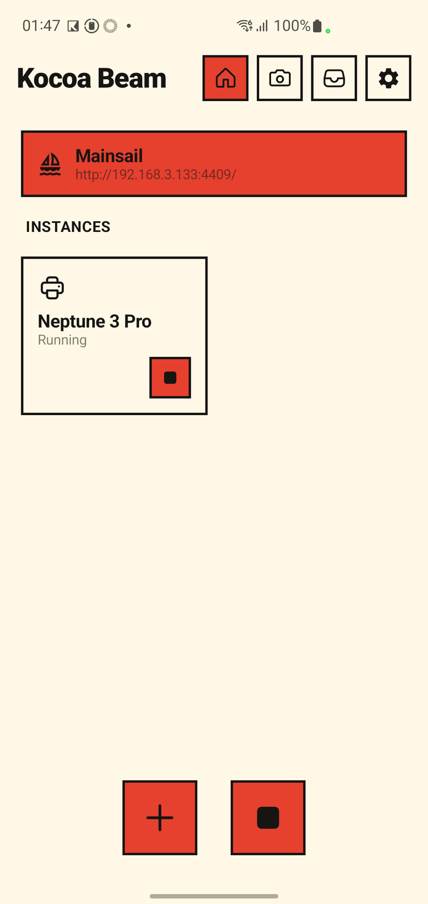
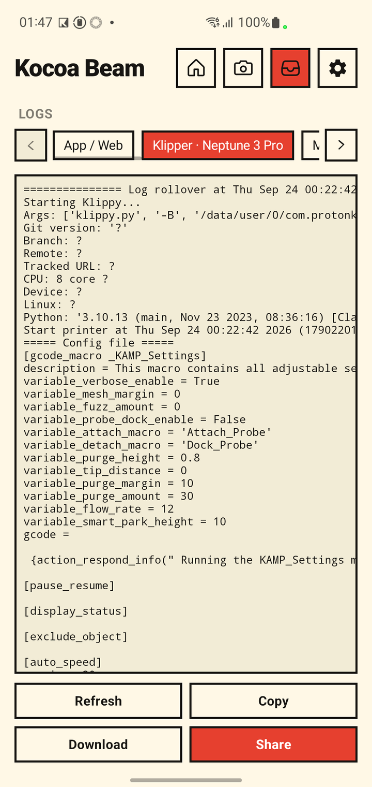
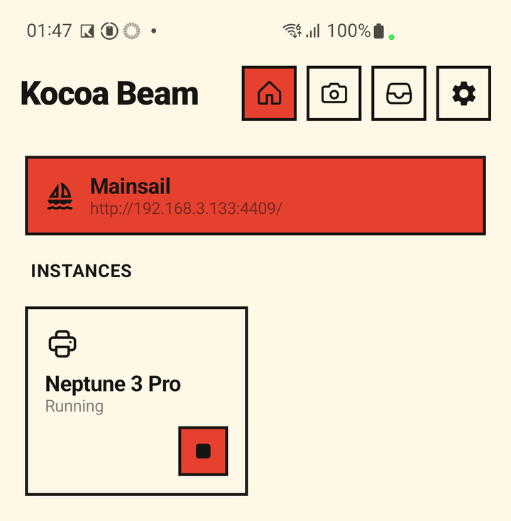
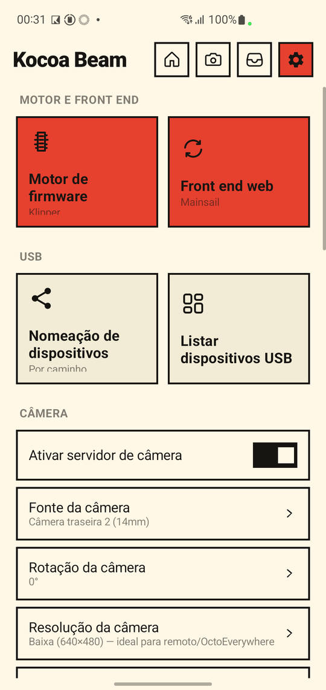
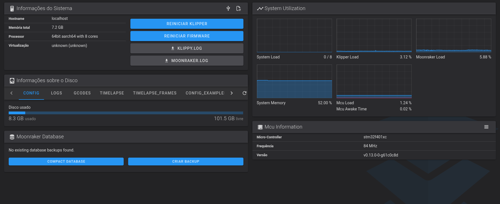

# Kocoa Beam - Klipper para Android

  
  
  
  

**Leia em outros idiomas: [English](README.md) · [Português (BR)](README.pt-br.md) · [简体中文](README.zh-Hans.md) · [繁體中文](README.zh-Hant.md)**

  
  

> **Só quer instalar?** Baixe o APK mais recente na
> [página de Releases](https://github.com/Brozinga/Kocoa-Beam/releases/latest)
> — na dúvida, escolha `armv7` (veja
> [Escolhendo o pacote certo](#escolhendo-o-pacote-certo) abaixo).

<strong>📑 Sumário</strong>

- [De onde vem o nome?](#de-onde-vem-o-nome)
- [Por que Kocoa Beam?](#por-que-kocoa-beam)
- [Escolhendo o pacote certo](#escolhendo-o-pacote-certo)
- [O que este projeto altera](#o-que-este-projeto-altera)
- [Início rápido](#início-rápido)
- [Capturas de tela](#capturas-de-tela)
- [Versões do firmware (MCU)](#versões-do-firmware-mcu)
- [Documentação](#documentação)
- [Posso usar o aparelho normalmente depois de instalar o Kocoa Beam?](#posso-usar-o-aparelho-normalmente-depois-de-instalar-o-kocoa-beam)
- [O que é IP:porta?](#o-que-é-ipporta)
- [O que vem dentro?](#o-que-vem-dentro)
- [Atualizações](#atualizações)
- [Extensões Android](#extensões-android)
- [Início automático](#início-automático)
- [Aviso sobre atividade em segundo plano](#aviso-sobre-atividade-em-segundo-plano)
- [Suporte a Android TV?](#suporte-a-android-tv)
- [Qual hub USB usar?](#qual-hub-usb-usar)
- [Limitações](#limitações)
- [Compilando](#compilando)
- [Créditos](#créditos)
- [Contribuindo](#contribuindo)

## De onde vem o nome?

**Kocoa Beam** é uma referência ao cacau — a base suave e encorpada do chocolate. Assim como o cacau é transformado em algo quente e agradável, o Kocoa Beam pega a energia bruta do [Beam Klipper](https://github.com/utkabobr/BeamKlipper) e a refina numa experiência mais macia e adocicada.

O "K" homenageia as raízes em Kotlin e a herança do Klipper. O "Beam" é um tributo ao [Beam Klipper](https://github.com/utkabobr/BeamKlipper) original, de [ProtonKicker](https://github.com/ProtonKicker). Juntos, formam um nome tão acolhedor quanto uma xícara de chocolate quente.

O Kocoa Beam permite rodar o host [Klipper](https://github.com/KevinOConnor/klipper) ou [Kalico](https://github.com/KalicoDTU/kalico) em qualquer dispositivo Android 5.0+ com suporte a OTG.

## Por que Kocoa Beam?

O Kocoa Beam é uma reformulação completa do Beam Klipper, com três grandes melhorias:

### 1. Reescrito em Kotlin
O aplicativo inteiro foi migrado de Java para Kotlin, trazendo:
- **Null safety** — prevenção de NullPointerException em tempo de compilação
- **Coroutines** — limpeza automática de threads em segundo plano, sem vazamentos
- **Data classes imutáveis** — mensagens do event bus e entidades de banco thread-safe
- **Smart casts e checagem de exaustividade** — bugs pegos ao compilar, não em runtime

### 2. Tamanho muito menor
O Kocoa Beam é bem menor que o Beam Klipper original:

| Componente | Beam Klipper | Kocoa Beam |
|-----------|-------------|------------|
| Timelapse com FFmpeg | Binário embutido (~40 MB) | API MediaCodec do Android (nativo) |
| Tamanho do app | ~138 MB (arm64) | ~38 MB (arm64 / armv7), ~41 MB (x86_64) |

O componente de timelapse com FFmpeg foi substituído pela API MediaCodec nativa do Android, economizando ~40 MB por arquitetura.

### 3. Interface nova
O Kocoa Beam tem um redesenho completo de UI:
- Estética brutalista "bento-box" com paleta "Papel/Mel/Tinta"
- Sombras deslocadas duras e bordas marcantes
- Implementação moderna em Jetpack Compose
- Layout e usabilidade melhorados

### Recursos adicionais
- **10 instâncias simultâneas** — rode até 10 perfis de impressora ao mesmo tempo (contra 4 no Beam Klipper)
- **Suporte a dois firmwares** — rode o engine Klipper ou Kalico
- **Timelapse nativo** — usa o MediaCodec por hardware do Android em vez de FFmpeg embutido
- **Operação 100% local** — sem conexão com nuvem; todos os dados ficam no dispositivo (suporte ao Beam Cloud removido)

## Escolhendo o pacote certo

O Kocoa Beam fornece três variantes de APK:

| Arquitetura | Nome do pacote | Quando usar |
|-------------|--------------|-------------|
| arm64 | `KocoaBeam_*_arm64.apk` | Dispositivos 64-bit modernos |
| armv7 | `KocoaBeam_*_armv7.apk` | Dispositivos 32-bit antigos — funciona na maioria dos aparelhos (recomendado na dúvida) |
| x86_64 | `KocoaBeam_*_amd64.apk` | Tablets x86_64, Chromebooks, emuladores Android |

**Como descobrir a arquitetura do seu dispositivo:**
- **Configurações > Sobre o telefone > Arquitetura** ou **Arquitetura do kernel**
- Ou instale um app de info de CPU como "CPU-Z" ou "AIDA64"
- Na dúvida, escolha armv7 — é o pacote que funciona no maior número de aparelhos

## O que este projeto altera

Este projeto mantém o Klipper / Moonraker / Fluidd / Mainsail / Happy Hare embutidos atualizados e adiciona diagnóstico no aparelho, add-ons opcionais do Klipper e ferramentas de firmware. Detalhes:

- [`docs/pt-br/getting-started.md`](docs/pt-br/getting-started.md) — **passo a passo para iniciantes**: instalar o APK, adicionar uma impressora (com prints), corrigir os avisos de "configuração faltando" do Fluidd/Mainsail
- [`docs/pt-br/whats-new.md`](docs/pt-br/whats-new.md) — lista completa das mudanças
- [`docs/pt-br/build-firmware.md`](docs/pt-br/build-firmware.md) — compilar firmware do MCU para qualquer placa
- [`docs/pt-br/mods/klipper-addons.md`](docs/pt-br/mods/klipper-addons.md) — os add-ons embutidos
- [`docs/pt-br/mods/input-shaper-manual.md`](docs/pt-br/mods/input-shaper-manual.md) — input shaper sem acelerômetro
- [`docs/pt-br/`](docs/pt-br/index.md) — índice da documentação

## Início rápido

> Primeira vez? Siga o passo a passo com prints: [`docs/pt-br/getting-started.md`](docs/pt-br/getting-started.md).

1. **Firmware do MCU** — grave na placa da impressora, usando:
   - uma imagem pré-compilada da [lista de firmwares do Beam Klipper](https://github.com/utkabobr/klipper/releases)
     (o conjunto `prebuilt-v0.12.0` cobre muitas placas), **ou**
   - um build novo do Klipper 0.13 — um comando via
     [`docs/pt-br/build-firmware.md`](docs/pt-br/build-firmware.md) (Docker ou script local,
     para qualquer placa suportada).

   Klipper 0.13 é o recomendado; imagens pré-compiladas mais antigas também funcionam.
2. Instale o APK da sua CPU pela [página de Releases](https://github.com/Brozinga/Kocoa-Beam/releases/latest).
3. Conceda as permissões pedidas.
4. Adicione uma instância de impressora (escolha um `generic-*.cfg` se a sua não estiver na lista).
5. Inicie a instância.
6. Abra a interface web: Fluidd `http://IP:4408/` ou Mainsail `http://IP:4409/` — a URL
   ativa aparece na tela principal. A porta serial é detectada automaticamente.

> **Travou em algum passo?** A aba **Logs** do app (print acima) mostra os
> logs do Klipper, do Moonraker e do próprio aplicativo, e deixa copiar/
> compartilhar sem precisar de PC — útil se algo acima não funcionar como
> esperado.

## Capturas de tela

**No celular/tablet**

| Tela principal | Configurações | Pré-visualização da câmera | Zoom (2×) |
|:-:|:-:|:-:|:-:|
|  |  |  |  |
| Inicia/para as impressoras; mostra o endereço web | Motor de firmware, front end web, USB, câmera, acesso remoto, idioma | Nova aba: veja o que a câmera enxerga | Os níveis de zoom dependem da câmera selecionada |

**No navegador** — as interfaces web são servidas pelo próprio aparelho, com a impressora conectada e a webcam ao vivo:

  
  

Fluidd (esquerda) e Mainsail (direita)

A aba **Logs** do app aparece no topo desta página.

## Versões do firmware (MCU)

A placa-mãe da impressora (MCU) precisa do próprio firmware do Klipper, gravado **uma vez** a partir de um PC. Você tem três opções:

| Opção | Ideal para | Como |
|---|---|---|
| **Imagem pré-compilada** | Iniciantes — sem compilar | Baixe o arquivo da sua placa nas [releases de firmware do Beam Klipper](https://github.com/utkabobr/klipper/releases) (o conjunto `prebuilt-v0.12.0` cobre muitas placas) e grave como de costume para a sua placa (cartão SD, DFU, …) |
| **Build com Docker** | Usuários experientes, Klipper mais novo | `docker compose -f firmware/docker-compose.yml run --rm fw <placa>` |
| **Script local** | Igual, sem Docker | `./scripts/build_firmware.sh <placa>` |

- **Klipper 0.13** é o recomendado, mas imagens pré-compiladas mais antigas (ex.: 0.12) também funcionam: o Klipper não tem trava rígida de versão entre MCU e host.
- Sua placa não está na lista? Salve um `.config` com `make menuconfig` e passe para o script de build.

Guia completo: [`docs/pt-br/build-firmware.md`](docs/pt-br/build-firmware.md).

## Documentação

Tudo abaixo está em [`docs/pt-br/`](docs/pt-br/index.md) (também em English e 简体中文):

| Eu quero… | Leia |
|---|---|
| Instalar o app e configurar minha primeira impressora, passo a passo | [`getting-started.md`](docs/pt-br/getting-started.md) |
| Ver o que mudou em relação ao Beam Klipper | [`whats-new.md`](docs/pt-br/whats-new.md) |
| Configurar câmera, webcam USB, pré-visualização, zoom e toque para focar | [`webcam.md`](docs/pt-br/webcam.md) |
| Acessar a impressora remotamente | [`octoeverywhere.md`](docs/pt-br/octoeverywhere.md) · [`obico.md`](docs/pt-br/obico.md) |
| Compilar/gravar o firmware do MCU | [`build-firmware.md`](docs/pt-br/build-firmware.md) |
| Compilar o APK eu mesmo | [`build-app.md`](docs/pt-br/build-app.md) |
| Ativar add-ons do Klipper / ajustar input shaper | [`mods/klipper-addons.md`](docs/pt-br/mods/klipper-addons.md) · [`mods/input-shaper-manual.md`](docs/pt-br/mods/input-shaper-manual.md) |

## Posso usar o aparelho normalmente depois de instalar o Kocoa Beam?

**Sim!** Com certeza pode!

O Kocoa Beam não faz **nada** com o seu sistema Android, ele roda no espaço de usuário como um app comum.

## O que é IP:porta?

Aparece na tela principal sempre que alguma instância está rodando. Cada front end tem a própria porta, acompanhando o seletor de front end na tela principal:

- Fluidd => `http://IP:4408/`
- Mainsail => `http://IP:4409/`

URLs da câmera:
- /webcam/?action=stream => `http://IP:8889/`
- /webcam/?action=snapshot => `http://IP:8889/snapshot`

A config de câmera recomendada é mjpeg-**stream** (não adaptive mjpeg) para o Fluidd e UV4L-MJPEG para o Mainsail.

## O que vem dentro?

O Kocoa Beam embute:
- [Klipper](https://github.com/KevinOConnor/klipper)
- [Kalico](https://github.com/KalicoDTU/kalico)
- [Moonraker](https://github.com/Arksine/moonraker)
- [Fluidd](https://github.com/fluidd-core/fluidd)
- [Mainsail](https://github.com/mainsail-crew/mainsail)
- [Happy Hare](https://github.com/moggieuk/Happy-Hare)
- [Klipper TMC Autotune](https://github.com/andrewmcgr/klipper_tmc_autotune)
- [Moonraker-timelapse](https://github.com/mainsail-crew/moonraker-timelapse)

## Atualizações

Versões dos componentes embutidos neste projeto:

| Componente | Versão |
|---|---|
| Klipper / Kalico | upstream atual (alvo do firmware do MCU: 0.13) |
| Moonraker | 0.11.0 |
| Fluidd | 1.37.5 |
| Mainsail | 2.19.0 |
| Happy Hare | v4.0.0 |
| OctoEverywhere | companion vendorizado, adaptado para rodar nativamente no Android |
| Obico | companion vendorizado, adaptado para rodar nativamente no Android (Cloud ou auto-hospedado) |

Add-ons opcionais do Klipper também são embutidos (KAMP, LED Effect, Z Calibration, Auto Speed, TMC Autotune) — veja [`docs/pt-br/mods/klipper-addons.md`](docs/pt-br/mods/klipper-addons.md). Lista completa: [`docs/pt-br/whats-new.md`](docs/pt-br/whats-new.md).

### Adições recentes

- **Suporte a webcam USB genérica** — detecta automaticamente uma webcam
  USB UVC conectada e prioriza ela em vez da câmera embutida, com troca a
  quente ao vivo, um seletor que diferencia várias lentes (principal/
  ultra-wide/telefoto, pela distância focal equivalente em 35mm), e um
  controle de rotação. Guia: [`docs/pt-br/webcam.md`](docs/pt-br/webcam.md).
- **Acesso remoto via OctoEverywhere** — o companion real do OctoEverywhere
  para Klipper, vendorizado e adaptado para rodar nativamente como processo
  Android em vez do serviço systemd que ele normalmente instala. Ative em
  Configurações → Acesso remoto, vincule por QR code. Guia:
  [`docs/pt-br/octoeverywhere.md`](docs/pt-br/octoeverywhere.md).
- **Interface do app em vários idiomas** — adicionado o Português do Brasil
  como idioma completo no app, junto com Inglês/Russo/Chinês (Simplificado
  e Tradicional).
- **Logs do OctoEverywhere no app** — o log dele agora aparece na aba Logs
  junto com Klipper/Moonraker, para diagnóstico sem precisar de adb.
- **Configuração de resolução de câmera + estabilidade de streaming** — uma
  resolução configurável (Baixa/Média/Alta) além do controle de rotação,
  mais correções para streaming travado/lento em WiFi congestionada
  (backpressure por espectador, para uma conexão lenta não travar o feed
  de todo mundo, e qualidade JPEG que se ajusta automaticamente às
  condições da rede).
- **Acesso remoto via Obico** — o companion real do Obico para Klipper/
  Moonraker, vendorizado e adaptado para rodar nativamente como processo
  Android, conectando ao Obico Cloud ou a um Obico Server auto-hospedado.
  Ative em Configurações → Acesso remoto; o app gera e mostra o próprio
  código de vinculação (mesmo fluxo do onboarding "Klipper, self-installed"
  do Obico), com um campo de código manual como alternativa. Guia:
  [`docs/pt-br/obico.md`](docs/pt-br/obico.md).

- **Aba de pré-visualização da câmera** — com o servidor de câmera ativado, surge uma aba ao lado de Logs mostrando a transmissão ao vivo (a mesma que o Fluidd/Mainsail recebem). Pede a permissão da câmera se necessário e desconecta ao sair da aba.
- **Zoom da câmera** — Configurações → Câmera → Zoom da câmera. Só aparecem os níveis de zoom que a câmera selecionada realmente suporta (ultra-wide, teleobjetiva ou webcam USB têm limites diferentes). Guia: [`docs/pt-br/webcam.md`](docs/pt-br/webcam.md).
- **Toque para focar** — na aba de pré-visualização da câmera, toque na imagem para focar naquele ponto; um quadrado amarelo mostra onde. Só é oferecido quando a câmera selecionada suporta. Guia: [`docs/pt-br/webcam.md`](docs/pt-br/webcam.md).

## Extensões Android

O Kocoa Beam oferece algumas extensões para controlar recursos nativos.

### Câmera

Inclua `[kocoa_camera]` no seu printer.cfg

`SET_CAMERA_FLASHLIGHT ENABLED=true/false` - Liga/desliga a lanterna

`SET_CAMERA_FOCUS AUTOFOCUS=true/false FOCUS_DISTANCE=0...?` - Define o autofoco da câmera e a distância de foco quando o autofoco está desligado. `FOCUS_DISTANCE` é em dioptrias e varia de aparelho para aparelho.

### Buzzer

Inclua `[include kocoa_beeper.cfg]` no seu printer.cfg

Use a macro `M300` [como definida na doc](https://marlinfw.org/docs/gcode/M300.html)

## Início automático

Você pode deixar o app em autostart marcando as impressoras desejadas como autostart **E** definindo o app como launcher padrão.

Você **precisa** remover o PIN da tela de bloqueio se o dispositivo for criptografado (padrão na maioria dos aparelhos).

## Aviso sobre atividade em segundo plano

Alguns fabricantes limitam o desempenho ou os processos em segundo plano do app. Você contorna isso definindo o app como launcher padrão e permitindo todas as tarefas em segundo plano.

## Suporte a Android TV?

Sim. Deve funcionar normalmente. Mas note que alguns TV boxes baratos não deixam definir o Kocoa Beam como launcher sem antes desativar o launcher do sistema — use ADB ou root para isso.

## Qual hub USB usar?

O autor usa um hub UGREEN Type-C (sem afiliação, só esperando a UGREEN chamar :D), mas qualquer um serve se funcionar com o seu aparelho e carregar ao mesmo tempo.

## Limitações

- O servidor web não roda na porta padrão porque o Android/Linux não deixa apps de espaço de usuário usarem portas abaixo de 1024, e a porta 80 seria a de `http://IP`
- Alguns aparelhos resetam o caminho do dispositivo após reiniciar o firmware — nesse caso use nomeação por VID/PID
- Sem SSH (você não vai compilar firmware nem rodar serviços extras no aparelho de qualquer forma)
- Alguns aparelhos não suportam OTG e carga ao mesmo tempo — nesse caso é preciso soldar direto nos pinos da bateria (ou usar outro aparelho, você decide)
- Só é suportado o baud rate 250000 (o autor não quis repassar essa configuração ao driver USB do Android; quase toda config usa 250000 mesmo)

> **Problema mais comum:** se o seu celular não consegue carregar e falar com
> a impressora ao mesmo tempo pelo mesmo cabo, é a limitação de OTG+carga
> acima — um hub USB com fonte própria (veja [Qual hub USB usar?](#qual-hub-usb-usar)) resolve.

## Compilando

Setup em um comando (instala o SDK / NDK / CMake fixados, um Python 3.10 para o Chaquopy, e grava o `local.properties`):

- Linux / macOS: `./scripts/setup.sh`
- Windows: `.\scripts\setup.ps1`

Depois `./gradlew :app:assembleArm64Debug`, ou abra o projeto no Android Studio e clique em Run. Detalhes, passos manuais e assinatura: [`docs/pt-br/build-app.md`](docs/pt-br/build-app.md).

## Créditos

- **[ProtonKicker/Kocoa-Beam](https://github.com/ProtonKicker)** — portou o aplicativo para Kotlin e refez o visual.
- **[Beam Klipper](https://github.com/utkabobr/BeamKlipper)** — o projeto original que deu origem a este.
- Klipper, Kalico, Moonraker, Fluidd, Mainsail e os demais componentes embutidos pertencem aos seus respectivos autores (veja [O que vem dentro?](#o-que-vem-dentro)).

## Contribuindo

Pull requests são bem-vindos!
