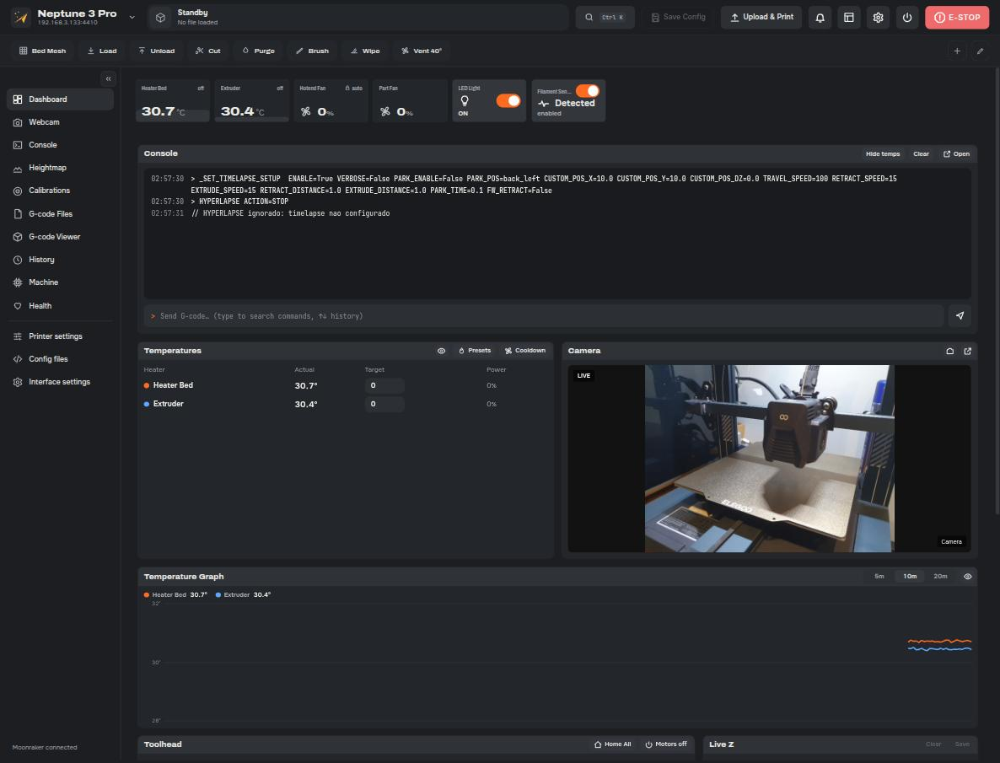
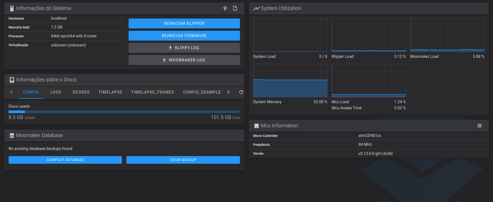

# Kocoa Beam - Klipper para Android

  
  
  
  

**Leia em outros idiomas: [English](README.md) · [Português (BR)](README.pt-br.md) · [简体中文](README.zh-Hans.md) · [繁體中文](README.zh-Hant.md)**

  
  

> **Só quer instalar?** Baixe o APK mais recente na
> [página de Releases](https://github.com/Brozinga/Kocoa-Beam/releases/latest)
> — na dúvida, escolha `armv7` (veja
> [Escolhendo o pacote certo](#escolhendo-o-pacote-certo) abaixo).

<strong>📑 Sumário</strong>

- [De onde vem o nome?](#de-onde-vem-o-nome)
- [Por que Kocoa Beam?](#por-que-kocoa-beam)
- [O que este projeto altera](#o-que-este-projeto-altera)
- [Escolhendo o pacote certo](#escolhendo-o-pacote-certo)
- [Início rápido](#início-rápido)
- [Capturas de tela](#capturas-de-tela)
- [Documentação](#documentação)
- [O que é IP:porta?](#o-que-é-ipporta)
- [O que vem dentro?](#o-que-vem-dentro)
- [Atualizações](#atualizações)
- [Extensões Android](#extensões-android)
- [Início automático](#início-automático)
- [Aviso sobre atividade em segundo plano](#aviso-sobre-atividade-em-segundo-plano)
- [Suporte a Android TV?](#suporte-a-android-tv)
- [Qual hub USB usar?](#qual-hub-usb-usar)
- [Limitações](#limitações)
- [Compilando](#compilando)
- [Créditos](#créditos)
- [Contribuindo](#contribuindo)

## De onde vem o nome?

**Kocoa Beam** é uma referência ao cacau — a base suave e encorpada do chocolate. Assim como o cacau é transformado em algo quente e agradável, o Kocoa Beam pega a energia bruta do [Beam Klipper](https://github.com/utkabobr/BeamKlipper) e a refina numa experiência mais macia e adocicada.

O "K" homenageia as raízes em Kotlin e a herança do Klipper. O "Beam" é um tributo ao [Beam Klipper](https://github.com/utkabobr/BeamKlipper) original, de [ProtonKicker](https://github.com/ProtonKicker). Juntos, formam um nome tão acolhedor quanto uma xícara de chocolate quente.

O Kocoa Beam permite rodar o host [Klipper](https://github.com/KevinOConnor/klipper) ou [Kalico](https://github.com/KalicoDTU/kalico) em qualquer dispositivo Android 5.0+ com suporte a OTG.

## Por que Kocoa Beam?

O Kocoa Beam é uma reformulação completa do Beam Klipper, com três grandes melhorias:

### 1. Reescrito em Kotlin
O aplicativo inteiro foi migrado de Java para Kotlin, trazendo:
- **Null safety** — prevenção de NullPointerException em tempo de compilação
- **Coroutines** — limpeza automática de threads em segundo plano, sem vazamentos
- **Data classes imutáveis** — mensagens do event bus e entidades de banco thread-safe
- **Smart casts e checagem de exaustividade** — bugs pegos ao compilar, não em runtime

### 2. Tamanho muito menor
O Kocoa Beam é bem menor que o Beam Klipper original:

| Componente | Beam Klipper | Kocoa Beam |
|-----------|-------------|------------|
| Timelapse com FFmpeg | Binário embutido (~40 MB) | API MediaCodec do Android (nativo) |
| Tamanho do app | ~138 MB (arm64) | ~38 MB (arm64 / armv7), ~41 MB (x86_64) |

O componente de timelapse com FFmpeg foi substituído pela API MediaCodec nativa do Android, economizando ~40 MB por arquitetura.

### 3. Interface nova
O Kocoa Beam tem um redesenho completo de UI:
- Estética brutalista "bento-box" com paleta "Papel/Mel/Tinta"
- Sombras deslocadas duras e bordas marcantes
- Implementação moderna em Jetpack Compose
- Layout e usabilidade melhorados

## O que este projeto altera

Tudo o que foi adicionado ou corrigido sobre o Beam Klipper (detalhes nos guias linkados):

**Plataforma e interface**
- [x] Reescrita em Kotlin
- [x] Interface nova
- [x] 10 instâncias de impressora simultâneas
- [x] Motores de firmware Klipper e Kalico
- [x] Operação somente local (Beam Cloud removido)
- [x] Idioma do app em português do Brasil
- [x] Aba de Logs no app
- [x] Log de falhas
- [x] Porta web separada por front end

**Software embutido**
- [x] Suporte ao Klipper 0.13 — [`build-firmware.md`](docs/pt-br/build-firmware.md)
- [x] Atualização do Moonraker (0.11.0)
- [x] Atualização do Fluidd (1.37.5)
- [x] Atualização do Mainsail (2.19.0)
- [x] Atualização do Happy Hare (v4.0.0)
- [x] Voyager UI (v0.23)
- [x] Add-ons do Klipper: KAMP, LED Effect, Z Calibration, Auto Speed, TMC Autotune — [`mods/klipper-addons.md`](docs/pt-br/mods/klipper-addons.md)
- [x] Input shaper sem acelerômetro — [`mods/input-shaper-manual.md`](docs/pt-br/mods/input-shaper-manual.md)
- [x] Modelo inicial de `printer.cfg` e perfis de impressora — [`getting-started.md`](docs/pt-br/getting-started.md)
- [x] Ferramentas para compilar o firmware do MCU (Docker e script local) — [`build-firmware.md`](docs/pt-br/build-firmware.md)

**Recursos**
- [x] Timelapse nativo (MediaCodec no lugar do FFmpeg) — [`timelapse.md`](docs/pt-br/timelapse.md)
- [x] Suporte a webcam USB, resolução e rotação da câmera — [`webcam.md`](docs/pt-br/webcam.md)
- [x] Pré-visualização da câmera ao vivo, zoom e toque para focar — [`webcam.md`](docs/pt-br/webcam.md)
- [x] Estabilidade do streaming em WiFi fraco — [`webcam.md`](docs/pt-br/webcam.md)
- [x] Recuperação de impressão após queda de energia — [`print-recovery.md`](docs/pt-br/print-recovery.md)
- [x] Acesso remoto com OctoEverywhere — [`octoeverywhere.md`](docs/pt-br/octoeverywhere.md)
- [x] Acesso remoto com Obico — [`obico.md`](docs/pt-br/obico.md)

**Correções**
- [x] Correção da renderização do timelapse — [`timelapse.md`](docs/pt-br/timelapse.md)
- [x] Correção dos metadados e miniaturas do G-code
- [x] Correção dos arquivos estáticos do Fluidd/Mainsail (tipos MIME)
- [x] Correção dos macros do Klipper que não faziam nada
- [x] Correção do Klipper abortando ao iniciar com opções `[mcu]` padrão

## Escolhendo o pacote certo

O Kocoa Beam fornece três variantes de APK:

| Arquitetura | Nome do pacote | Quando usar |
|-------------|--------------|-------------|
| arm64 | `KocoaBeam_*_arm64.apk` | Dispositivos 64-bit modernos |
| armv7 | `KocoaBeam_*_armv7.apk` | Dispositivos 32-bit antigos — funciona na maioria dos aparelhos (recomendado na dúvida) |
| x86_64 | `KocoaBeam_*_amd64.apk` | Tablets x86_64, Chromebooks, emuladores Android |

**Como descobrir a arquitetura do seu dispositivo:**
- **Configurações > Sobre o telefone > Arquitetura** ou **Arquitetura do kernel**
- Ou instale um app de info de CPU como "CPU-Z" ou "AIDA64"
- Na dúvida, escolha armv7 — é o pacote que funciona no maior número de aparelhos

## Início rápido

**Comece aqui: [`docs/pt-br/getting-started.md`](docs/pt-br/getting-started.md)** — o passo a passo ilustrado para instalar o Kocoa Beam e executá-lo pela primeira vez (APK, primeira impressora, firmware do MCU, abrir a interface web).

> **Travou em algum passo?** A aba **Logs** do app (print acima) mostra os logs do Klipper, Moonraker e do app, e permite copiá-los/compartilhá-los sem PC — útil se algo não funcionar como esperado.

## Capturas de tela

**No celular/tablet**

| Tela principal | Configurações | Pré-visualização da câmera | Zoom (2×) |
|:-:|:-:|:-:|:-:|
|  |  |  |  |
| Inicia/para as impressoras; mostra o endereço web | Motor de firmware, front end web, USB, câmera, acesso remoto, idioma | Nova aba: veja o que a câmera enxerga | Os níveis de zoom dependem da câmera selecionada |

**No navegador** — as interfaces web são servidas pelo próprio aparelho, com a impressora conectada e a webcam ao vivo:

<b>Fluidd</b> 

<b>Mainsail</b> 

<b>Voyager UI</b> 

**Recuperação de impressão** — após uma queda de energia, Fluidd e Mainsail oferecem retomar a impressão ([guia](docs/pt-br/print-recovery.md)):

A aba **Logs** do app aparece no topo desta página.

## Documentação

Tudo abaixo está em [`docs/pt-br/`](docs/pt-br/index.md) (também em English e 简体中文):

| Eu quero… | Leia |
|---|---|
| Instalar o app e configurar minha primeira impressora, passo a passo | [`getting-started.md`](docs/pt-br/getting-started.md) |
| Retomar uma impressão após queda de energia | [`print-recovery.md`](docs/pt-br/print-recovery.md) |
| Gravar um timelapse e achar o vídeo | [`timelapse.md`](docs/pt-br/timelapse.md) |
| Configurar câmera, webcam USB, pré-visualização, zoom e toque para focar | [`webcam.md`](docs/pt-br/webcam.md) |
| Acessar a impressora remotamente | [`octoeverywhere.md`](docs/pt-br/octoeverywhere.md) · [`obico.md`](docs/pt-br/obico.md) |
| Compilar/gravar o firmware do MCU | [`build-firmware.md`](docs/pt-br/build-firmware.md) |
| Compilar o APK eu mesmo | [`build-app.md`](docs/pt-br/build-app.md) |
| Ativar add-ons do Klipper / ajustar input shaper | [`mods/klipper-addons.md`](docs/pt-br/mods/klipper-addons.md) · [`mods/input-shaper-manual.md`](docs/pt-br/mods/input-shaper-manual.md) |

## O que é IP:porta?

Aparece na tela principal sempre que alguma instância está rodando. Cada front end tem a própria porta, acompanhando o seletor de front end na tela principal:

- Fluidd => `http://IP:4408/`
- Mainsail => `http://IP:4409/`
- Voyager UI => `http://IP:4410/`

## Extensões Android

O Kocoa Beam oferece algumas extensões para controlar recursos nativos.

### Câmera

Adicione `[beam_camera]` ao seu printer.cfg

`SET_CAMERA_FLASHLIGHT ENABLED=true/false` - Liga/desliga a lanterna

`SET_CAMERA_FOCUS AUTOFOCUS=true/false FOCUS_DISTANCE=0...?` - Define o autofoco da câmera e a distância de foco quando o autofoco está desligado. `FOCUS_DISTANCE` é em dioptrias e varia de aparelho para aparelho.

### Buzzer

Adicione `[include beam_beeper.cfg]` ao seu printer.cfg

Use a macro `M300` [como definida na doc](https://marlinfw.org/docs/gcode/M300.html)

## Início automático

Você pode deixar o app em autostart marcando as impressoras desejadas como autostart **E** definindo o app como launcher padrão.

Você **precisa** remover o PIN da tela de bloqueio se o dispositivo for criptografado (padrão na maioria dos aparelhos).

## Aviso sobre atividade em segundo plano

Alguns fabricantes limitam o desempenho ou os processos em segundo plano do app. Você contorna isso definindo o app como launcher padrão e permitindo todas as tarefas em segundo plano.

## Suporte a Android TV?

Sim. Deve funcionar normalmente. Mas note que alguns TV boxes baratos não deixam definir o Kocoa Beam como launcher sem antes desativar o launcher do sistema — use ADB ou root para isso.

## Qual hub USB usar?

O autor usa um hub UGREEN Type-C (sem afiliação, só esperando a UGREEN chamar :D), mas qualquer um serve se funcionar com o seu aparelho e carregar ao mesmo tempo.

## Limitações

- O servidor web não roda na porta padrão porque o Android/Linux não deixa apps de espaço de usuário usarem portas abaixo de 1024, e a porta 80 seria a de `http://IP`
- Alguns aparelhos resetam o caminho do dispositivo após reiniciar o firmware — nesse caso use nomeação por VID/PID
- Sem SSH (você não vai compilar firmware nem rodar serviços extras no aparelho de qualquer forma)
- Alguns aparelhos não suportam OTG e carga ao mesmo tempo — nesse caso é preciso soldar direto nos pinos da bateria (ou usar outro aparelho, você decide)
- Só é suportado o baud rate 250000 (o autor não quis repassar essa configuração ao driver USB do Android; quase toda config usa 250000 mesmo)

> **Problema mais comum:** se o seu celular não consegue carregar e falar com
> a impressora ao mesmo tempo pelo mesmo cabo, é a limitação de OTG+carga
> acima — um hub USB com fonte própria (veja [Qual hub USB usar?](#qual-hub-usb-usar)) resolve.

## Compilando

Setup em um comando (instala o SDK / NDK / CMake fixados, um Python 3.10 para o Chaquopy, e grava o `local.properties`):

- Linux / macOS: `./scripts/setup.sh`
- Windows: `.\scripts\setup.ps1`

Depois `./gradlew :app:assembleArm64Debug`, ou abra o projeto no Android Studio e clique em Run. Detalhes, passos manuais e assinatura: [`docs/pt-br/build-app.md`](docs/pt-br/build-app.md).

## Créditos

- **[ProtonKicker/Kocoa-Beam](https://github.com/ProtonKicker)** — portou o aplicativo para Kotlin e refez o visual.
- **[Beam Klipper](https://github.com/utkabobr/BeamKlipper)** — o projeto original que deu origem a este.
- Klipper, Kalico, Moonraker, Fluidd, Mainsail e os demais componentes embutidos pertencem aos seus respectivos autores (veja [O que vem dentro?](#o-que-vem-dentro)).
- **[Voyager UI](https://github.com/ozancs/voyager-ui)** de [ozancs](https://github.com/ozancs) — o terceiro front end web que você pode escolher ao lado de Fluidd e Mainsail.

## Contribuindo

Pull requests são bem-vindos!
