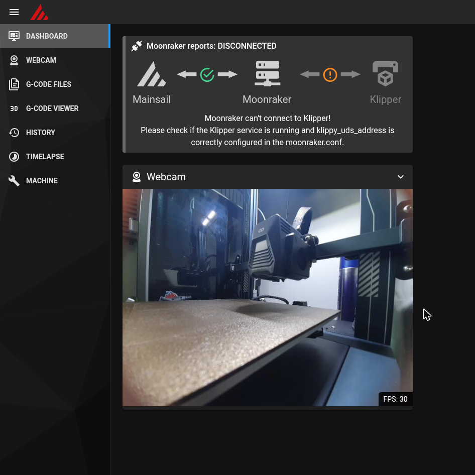

# Kocoa Beam - Android 上的 Klipper

  
  
  
  

**语言: [English](README.md) · [Português (BR)](README.pt-br.md) · [简体中文](README.zh-Hans.md) · [繁體中文](README.zh-Hant.md)**

  
  

> **只想安装？** 直接到 [Releases 页面](https://github.com/Brozinga/Kocoa-Beam/releases/latest)
> 下载最新 APK —— 不确定选哪个的话，选 `arm64`（详见下方
> [选择正确的安装包](#选择正确的安装包)）。

<strong>📑 目录</strong>

- [名字的由来](#名字的由来)
- [为什么选择 Kocoa Beam?](#为什么选择-kocoa-beam)
- [选择正确的安装包](#选择正确的安装包)
- [本项目改变了什么](#本项目改变了什么)
- [快速开始](#快速开始)
- [截图](#截图)
- [固件（MCU）版本](#固件mcu版本)
- [文档](#文档)
- [安装 Kocoa Beam 后设备还能正常使用吗?](#安装-kocoa-beam-后设备还能正常使用吗)
- [IP:端口是什么?](#ip端口是什么)
- [内置了什么?](#内置了什么)
- [更新](#更新)
- [Android 扩展](#android-扩展)
- [自动启动](#自动启动)
- [后台活动说明](#后台活动说明)
- [支持 Android TV 吗?](#支持-android-tv-吗)
- [用哪种 USB 集线器?](#用哪种-usb-集线器)
- [限制](#限制)
- [构建](#构建)
- [致谢](#致谢)
- [贡献](#贡献)

## 名字的由来

**Kocoa Beam** 的名字来源于可可豆——巧克力顺滑、浓郁的核心原料。正如可可豆被加工成温暖美味的巧克力一样，Kocoa Beam 也将 [Beam Klipper](https://github.com/utkabobr/BeamKlipper) 的原始能量提炼成更柔和、更甜美的体验。

"K" 代表 Kotlin 与 Klipper 的传承。"Beam" 则致敬原始的 [Beam Klipper](https://github.com/utkabobr/BeamKlipper)（由 [ProtonKicker](https://github.com/ProtonKicker) 创建）。两者结合，是一个如同热可可一般温暖亲切的名字。

Kocoa Beam 可以让你在任何支持 OTG 的 Android 5.0+ 设备上运行 [Klipper](https://github.com/KevinOConnor/klipper) 或 [Kalico](https://github.com/KalicoDTU/kalico) 主机软件。

## 为什么选择 Kocoa Beam?

Kocoa Beam 是 Beam Klipper 的全面升级，包含三大改进：

### 1. Kotlin 重写
整个应用已从 Java 迁移到 Kotlin，带来：
- **空安全** — 编译时防止 NullPointerException
- **协程** — 自动清理后台线程，无泄漏
- **不可变数据类** — 线程安全的事件总线消息和数据库实体
- **智能转换和穷举检查** — Bug 在编译时捕获，而非运行时

### 2. 体积大幅减小
Kocoa Beam 比原始 Beam Klipper 小很多：

| 组件 | Beam Klipper | Kocoa Beam |
|------|-------------|------------|
| FFmpeg 延时摄影 | 捆绑二进制文件（约 40 MB） | Android MediaCodec API（内置） |
| 应用大小 | 约 138 MB（arm64） | 约 38 MB（arm64 / armv7），约 41 MB（x86_64） |

FFmpeg 延时摄影组件已被 Android 原生 MediaCodec API 取代，每个架构节省约 40 MB。

### 3. 全新的 UI
Kocoa Beam 具有完全的 UI 重新设计：
- 粗野主义 Bento 风格，「纸/蜜/墨」配色
- 硬质偏移阴影和粗边框
- 现代 Jetpack Compose 实现
- 改进的布局和可用性

### 额外功能
- **10 个并发实例** — 同时运行最多 10 个打印机配置文件（对比 Beam Klipper 的 4 个）
- **双固件支持** — 运行 Klipper 或 Kalico 固件引擎
- **原生延时摄影** — 使用 Android 硬件 MediaCodec 而非捆绑 FFmpeg
- **本地运行** — 无云端连接，所有数据留在设备上（已移除 Beam Cloud 支持）

## 选择正确的安装包

Kocoa Beam 提供三个 APK 版本：

| 架构 | 包名称 | 适用场景 |
|------|--------|----------|
| arm64 | `KocoaBeam_*_arm64.apk` | 现代 64 位设备（推荐） |
| armv7 | `KocoaBeam_*_armv7.apk` | 旧式 32 位设备 |
| x86_64 | `KocoaBeam_*_amd64.apk` | x86_64 平板、Chromebook、Android 模拟器 |

**如何检查设备架构：**
- 前往「设置」>「关于手机」>「架构」或「内核架构」
- 或安装 CPU 信息 App 如「CPU-Z」或「AIDA64」
- 如有疑问，先尝试 arm64 — 2015 年后发布的设备大多支持

## 本项目改变了什么

本项目让内置的 Klipper / Moonraker / Fluidd / Mainsail / Happy Hare 保持最新，并增加了设备端诊断、可选的 Klipper 附加模块和固件工具。详情：

- [`docs/zh-Hans/whats-new.md`](docs/zh-Hans/whats-new.md) — 完整变更列表
- [`docs/zh-Hans/build-firmware.md`](docs/zh-Hans/build-firmware.md) — 为任意主板构建 MCU 固件
- [`docs/zh-Hans/mods/klipper-addons.md`](docs/zh-Hans/mods/klipper-addons.md) — 内置的附加模块
- [`docs/zh-Hans/mods/input-shaper-manual.md`](docs/zh-Hans/mods/input-shaper-manual.md) — 无加速度计调 input shaper
- [`docs/zh-Hans/`](docs/zh-Hans/index.md) — 文档索引

## 快速开始

1. **MCU 固件** — 刷写打印机主板，可以使用：
   - [Beam Klipper 固件列表](https://github.com/utkabobr/klipper/releases) 中的预编译镜像
     （`prebuilt-v0.12.0` 系列覆盖了大多数主板），**或者**
   - 全新编译的 Klipper 0.13 —— 通过
     [`docs/zh-Hans/build-firmware.md`](docs/zh-Hans/build-firmware.md) 一条命令搞定（Docker
     或本地脚本，支持任意受支持的主板）。

   推荐使用 Klipper 0.13；较旧的预编译镜像同样可用。
2. 从 [Releases 页面](https://github.com/Brozinga/Kocoa-Beam/releases/latest) 安装对应 CPU 架构的 APK。
3. 授予所需权限。
4. 添加打印机实例（列表中没有你的打印机时，选择 `generic-*.cfg`）。
5. 启动该实例。
6. 打开网页界面：Fluidd `http://IP:4408/` 或 Mainsail `http://IP:4409/` —— 当前生效的地址
   会显示在主界面上。串口会自动检测。

> **卡住了？** 应用内的 **Logs** 标签页（上方截图）显示 Klipper、Moonraker 和应用
> 自身的日志，并可以直接复制/分享，不需要电脑 —— 如果上面哪一步没按预期工作，
> 先去看看日志。

## 截图

**手机/平板上** —— 主界面、设置（摄像头、远程访问、语言）以及应用内 Logs 标签页：

  
  
  
  

**浏览器中** —— 由设备本身提供的网页界面。Fluidd（系统页面）与 Mainsail（带实时摄像头画面的仪表盘）：

  
  

## 固件（MCU）版本

打印机主板（MCU）需要自己的 Klipper 固件，只需在电脑上烧录**一次**。有三种方式：

| 方式 | 适合 | 做法 |
|---|---|---|
| **预编译镜像** | 新手 —— 无需编译 | 从 [Beam Klipper 固件发布页](https://github.com/utkabobr/klipper/releases) 下载对应主板的文件（`prebuilt-v0.12.0` 系列覆盖许多主板），按主板常规方式烧录（SD 卡、DFU 等） |
| **Docker 构建** | 进阶用户、最新 Klipper | `docker compose -f firmware/docker-compose.yml run --rm fw <主板>` |
| **本地脚本** | 同上，无需 Docker | `./scripts/build_firmware.sh <主板>` |

- 推荐 **Klipper 0.13**，但较旧的预编译镜像（如 0.12）同样可用：Klipper 对 MCU 与主机没有严格的版本锁定。
- 没有你的主板？用 `make menuconfig` 保存 `.config`，再传给构建脚本。

完整指南：[`docs/zh-Hans/build-firmware.md`](docs/zh-Hans/build-firmware.md)。

## 文档

以下内容均在 [`docs/zh-Hans/`](docs/zh-Hans/index.md)（另有 English 与 Português 版本）：

| 我想要… | 阅读 |
|---|---|
| 了解相比 Beam Klipper 有哪些改动 | [`whats-new.md`](docs/zh-Hans/whats-new.md) |
| 设置摄像头、USB 摄像头、预览与缩放 | [`webcam.md`](docs/zh-Hans/webcam.md) |
| 远程访问打印机 | [`octoeverywhere.md`](docs/zh-Hans/octoeverywhere.md) · [`obico.md`](docs/zh-Hans/obico.md) |
| 构建/烧录 MCU 固件 | [`build-firmware.md`](docs/zh-Hans/build-firmware.md) |
| 自己构建 APK | [`build-app.md`](docs/zh-Hans/build-app.md) |
| 启用 Klipper 附加模块 / 调 input shaper | [`mods/klipper-addons.md`](docs/zh-Hans/mods/klipper-addons.md) · [`mods/input-shaper-manual.md`](docs/zh-Hans/mods/input-shaper-manual.md) |

## 安装 Kocoa Beam 后设备还能正常使用吗?

**当然可以！**

Kocoa Beam 不会对 Android 系统做任何改动，它以普通 Android 应用的形式运行在用户空间。

## IP:端口是什么?

任意实例运行时，主页面都会显示该地址。每个前端有各自的端口，跟随主界面上的前端切换开关：

- Fluidd => `http://IP:4408/`
- Mainsail => `http://IP:4409/`

摄像头地址：
- /webcam/?action=stream => `http://IP:8889/`
- /webcam/?action=snapshot => `http://IP:8889/snapshot`

Fluidd 推荐使用 mjpeg-**stream**（非 adaptive mjpeg）摄像头配置，Mainsail 推荐 UV4L-MJPEG。

## 内置了什么?

Kocoa Beam 内置了：
- [Klipper](https://github.com/KevinOConnor/klipper)
- [Kalico](https://github.com/KalicoDTU/kalico)
- [Moonraker](https://github.com/Arksine/moonraker)
- [Fluidd](https://github.com/fluidd-core/fluidd)
- [Mainsail](https://github.com/mainsail-crew/mainsail)
- [Happy Hare](https://github.com/moggieuk/Happy-Hare)
- [Klipper TMC Autotune](https://github.com/andrewmcgr/klipper_tmc_autotune)
- [Moonraker-timelapse](https://github.com/mainsail-crew/moonraker-timelapse)

## 更新

本项目内置组件的版本：

| 组件 | 版本 |
|---|---|
| Klipper / Kalico | 当前上游（MCU 固件目标：0.13） |
| Moonraker | 0.11.0 |
| Fluidd | 1.37.5 |
| Mainsail | 2.19.0 |
| Happy Hare | v4.0.0 |
| OctoEverywhere | 伴生程序，改造后原生运行在 Android 上 |
| Obico | 伴生程序，改造后原生运行在 Android 上（Cloud 或自建服务器） |

可选启用的 Klipper 附加模块也已内置（KAMP、LED Effect、Z Calibration、Auto Speed、TMC Autotune）—— 见 [`docs/zh-Hans/mods/klipper-addons.md`](docs/zh-Hans/mods/klipper-addons.md)。完整变更列表：[`docs/zh-Hans/whats-new.md`](docs/zh-Hans/whats-new.md)。

### 近期新增

- **通用 USB 摄像头支持** — 自动检测已连接的 USB UVC 摄像头，并优先使用它而非
  内置摄像头，支持实时热插拔切换、能区分多个镜头的选择器（主镜头/超广角/长焦，
  按 35mm 等效焦距区分），以及旋转控制。指南：
  [`docs/zh-Hans/webcam.md`](docs/zh-Hans/webcam.md)。
- **OctoEverywhere 远程访问** — 真实的 OctoEverywhere Klipper 伴生程序，改造后以
  独立 Android 进程运行，而不是它通常安装的 systemd 服务。在「设置 → 远程访问」
  中开启，通过二维码关联。指南：
  [`docs/zh-Hans/octoeverywhere.md`](docs/zh-Hans/octoeverywhere.md)。
- **多语言应用界面** — 新增巴西葡萄牙语作为完整的应用内语言，与英语/俄语/中文
  （简体与繁体）并列。
- **应用内 OctoEverywhere 日志** — 它的日志现在与 Klipper/Moonraker 一起显示在
  Logs 标签页中，无需 adb 即可排查问题。
- **摄像头分辨率设置 + 推流稳定性** — 新增可配置的分辨率（低/中/高），加上旋转
  控制，并修复了 WiFi 拥堵时推流卡顿/延迟的问题（按观看者做背压控制，避免单个
  慢速连接拖垮所有人的画面；JPEG 画质会根据网络状况自动调整）。
- **Obico 远程访问** — 真实的 Obico Klipper/Moonraker 伴生程序，改造后以独立
  Android 进程运行，连接到 Obico Cloud 或自建的 Obico Server。在「设置 → 远程
  访问」中开启；应用会自行生成并显示关联验证码（与 Obico「Klipper, self-installed」
  引导流程相同），也提供手动输入验证码的备用方式。指南：
  [`docs/zh-Hans/obico.md`](docs/zh-Hans/obico.md)。

- **摄像头实时预览标签页** —— 启用摄像头服务器后，Logs 旁会出现新标签页，显示实时画面（与 Fluidd/Mainsail 获取的相同）。需要时会请求摄像头权限，离开标签页即断开。
- **摄像头缩放** —— 设置 → 摄像头 → 摄像头缩放。只提供所选摄像头真正支持的缩放档位（手机的超广角、长焦或 USB 摄像头限制各不相同）。指南：[`docs/zh-Hans/webcam.md`](docs/zh-Hans/webcam.md)。

## Android 扩展

Kocoa Beam 提供了一些附加扩展功能，用于控制内置功能。

### 摄像头

在 printer.cfg 中加入 `[kocoa_camera]`

`SET_CAMERA_FLASHLIGHT ENABLED=true/false` - 开关闪光灯

`SET_CAMERA_FOCUS AUTOFOCUS=true/false FOCUS_DISTANCE=0...?` - 设置摄像头自动对焦状态；关闭自动对焦时可设置焦距。`FOCUS_DISTANCE` 单位为屈光度，因设备而异。

### 蜂鸣器

在 printer.cfg 中加入 `[include kocoa_beeper.cfg]`

使用[文档中定义](https://marlinfw.org/docs/gcode/M300.html)的 `M300` 宏。

## 自动启动

将需要的打印机设置为自动启动，**并将应用设为默认桌面**，即可实现开机自启。

如果设备已加密（大多数设备默认开启），你**必须**移除锁屏 PIN 码。

## 后台活动说明

部分厂商可能会限制应用的后台进程或性能。可以将应用设为默认桌面并允许所有后台任务来规避。

## 支持 Android TV 吗?

支持，应该可以正常工作。但请注意，部分廉价电视盒子不支持直接将 Kocoa Beam 设为桌面，需要先用 ADB 或 root 禁用系统桌面。

## 用哪种 USB 集线器?

作者使用的是绿联（UGREEN）Type-C 集线器（非广告，只是在等绿联来合作 :D），只要能同时充电且与你的设备兼容，任何集线器都可以。

## 限制

- Web 服务器无法使用默认端口，因为 Android/Linux 不允许用户空间应用绑定 1024 以下的端口，而默认的 `http://IP` 需要 80 端口
- 部分设备在固件重启后会重置设备路径，这种情况下请使用 VID/PID 命名
- 不支持 SSH（也因此无法在设备上编译固件或运行额外的自启服务）
- 部分设备不支持同时 OTG 和充电，这种情况只能直接焊接到电池引脚（或者换一台设备，随你）
- 仅支持 250000 波特率（不想把这个设置转发到 Android USB 驱动，几乎所有配置都用 250000 而已）

> **最常见的坑：** 如果手机没法一边充电一边和打印机通信，就是上面说的 OTG+充电
> 限制 —— 用一个自带供电的 USB 集线器（见[用哪种 USB 集线器?](#用哪种-usb-集线器)）就能解决。

## 构建

一键环境搭建（安装固定版本的 SDK / NDK / CMake、Chaquopy 所需的 Python 3.10，并写入 `local.properties`）：

- Linux / macOS：`./scripts/setup.sh`
- Windows：`.\scripts\setup.ps1`

然后运行 `./gradlew :app:assembleArm64Debug`，或者用 Android Studio 打开项目并点击 Run。详细步骤、手动配置和签名见 [`docs/zh-Hans/build-app.md`](docs/zh-Hans/build-app.md)。

## 致谢

- **[ProtonKicker/Kocoa-Beam](https://github.com/ProtonKicker)** —— 将应用移植到 Kotlin 并重做了界面。
- **[Beam Klipper](https://github.com/utkabobr/BeamKlipper)** —— 本项目的原始来源。
- Klipper、Kalico、Moonraker、Fluidd、Mainsail 及其他内置组件归各自作者所有（见[内置了什么?](#内置了什么)）。

## 贡献

欢迎提交 Pull Request！
