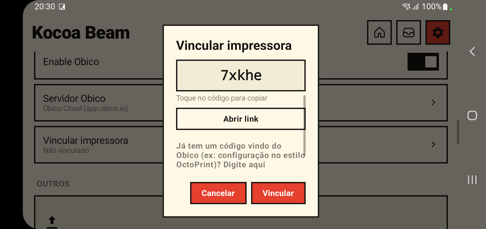

# Using Obico

**Languages: [English](obico.md) · [Português (BR)](pt-br/obico.md) · [简体中文](zh-Hans/obico.md)**

[Obico](https://www.obico.io) is a community-built, open-source smart 3D
printing platform: remote monitoring, print failure detection and remote
control, from Obico Cloud or your own self-hosted Obico Server. Kocoa Beam
runs the real `moonraker-obico` companion (vendored from
[TheSpaghettiDetective/moonraker-obico](https://github.com/TheSpaghettiDetective/moonraker-obico)),
adapted to run on-device instead of the systemd service it normally installs
as.

## Enabling it

1. Start a printer profile (it has to be **running** — Obico connects to
   whichever profile is currently active).
2. Go to **Settings → Remote access → Obico** and turn on **Enable Obico**.
3. Tap **Obico server** to pick where it connects:
   - **Obico Cloud** (`app.obico.io`) — the default, no account of your own
     to host.
   - **Self-hosted** — enter the URL of your own
     [Obico Server](https://www.obico.io/docs/server-guides/) instance.
   - Switching servers clears any existing link, since a link is only valid
     for the server that issued it.
4. Tap **Link printer**. Kocoa Beam generates its own code and shows it right
   there (it can take a few seconds after enabling Obico for the companion to
   start and produce one). In the Obico app or website, add a printer, choose
   **Klipper (self-installed)**, and enter that code when asked — or tap
   **Open link** in the dialog, which opens Obico's own linking page directly
   with the code pre-filled.
   - This mirrors exactly what Obico's own install script does on a real
     Klipper install (`./install.sh` → `python3 -m moonraker_obico.link`):
     it polls Obico's server every couple of seconds reporting an unlinked
     printer and a one-time code, until either you enter that code on
     Obico's side, or Obico's app finds it automatically because you're on
     the same account. No local-network broadcast is involved, so this works
     the same over WiFi as it would over a VPN or a phone's mobile data.
   - Already have a code the *other* way around — one Obico gave you, e.g.
     from an OctoPrint-style manual setup? The same dialog has a field to
     enter it instead.

5. Once linked, your printer shows up in the Obico app/website. To unlink,
   open **Link printer** again — the dialog shows an **Unlink** option once
   linked. Linking also completes automatically if Obico's app/website finds
   the printer on its own (same account) — no button in Kocoa Beam to press
   for that, the dialog just closes on its own once it happens.

## Webcam

Obico gets a snapshot of the webcam feed the same way Fluidd/Mainsail do:
through Moonraker's own webcam list. Enable the camera server and add it to
Fluidd or Mainsail once (config is shared between them) and Obico picks it up
automatically — full walkthrough with screenshots: [`webcam.md`](webcam.md).

Obico's real-time WebRTC preview (via a bundled `janus-gateway` process and
`ffmpeg`) is **not** available here — both are native binaries built for
desktop Linux/Raspberry Pi targets in the upstream project, not for Android,
and aren't bundled. This is a documented, supported config flag
(`disable_video_streaming`), not a patch to the companion's code. Obico still
gets a fresh snapshot periodically (every ~10s) for print monitoring and
failure detection, independent of that flag.

## Notes and limitations

- Only **one** printer profile can be linked at a time, even if you run
  several concurrently — Obico follows whichever profile reached "running"
  first.
- Obico's own crash telemetry (Sentry) is disabled by default; the actual
  connection to your chosen server is unaffected. It's also automatically
  disabled by the companion itself for any self-hosted server, regardless of
  this setting.
- **Confirmed working end-to-end on real hardware**: the companion
  connects to Moonraker, generates a real one-time code from the real Obico
  Cloud servers, and the printer has actually linked through that flow. The
  manual-code path has also been verified against the real servers (a
  deliberately wrong code correctly comes back "invalid").

## Troubleshooting

- **Logs**: `obico.log` lives alongside `klippy.log`/`moonraker.log` in that
  profile's `logs` folder — browse to it with a file manager app through
  Kocoa Beam's own storage entry (Android's Files app → "Kocoa Beam"), the
  same place you'd already look for Klipper/Moonraker/OctoEverywhere logs.
- **"Not linked" never changes after entering a code**: double check the
  code hasn't expired (Obico's codes are short-lived) and that you picked
  the right server (Cloud vs. self-hosted) — a code from one doesn't work
  against the other.
- **Self-hosted server unreachable**: the error message shown in the Link
  dialog is the actual network error (e.g. "unable to resolve host") — check
  the URL first, including `http://` vs `https://`.
