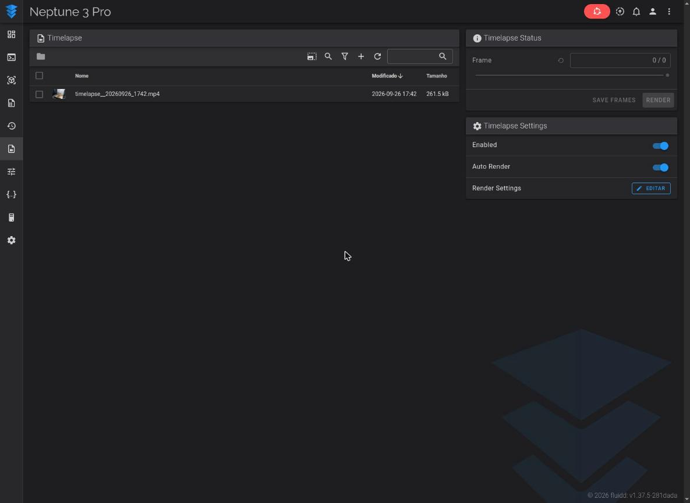

# Timelapse

**Idiomas: [English](../timelapse.md) · [Português (BR)](timelapse.md) · [简体中文](../zh-Hans/timelapse.md)**

O Kocoa Beam traz embutido o componente Moonraker-timelapse. Durante a
impressão ele tira uma foto da impressora a cada camada e, quando a impressão
termina, transforma as fotos em um vídeo — tudo no próprio celular, sem
computador nem nuvem. Você controla pela página **Timelapse** do Fluidd ou do
Mainsail.

## O que você precisa

- O **servidor de câmera ligado** (Configurações → Câmera → *Ativar servidor de
  câmera*), com uma câmera apontada para a impressora — a do próprio celular ou
  uma webcam USB. Veja [webcam.md](webcam.md). As fotos do timelapse vêm do
  endereço de snapshot do servidor de câmera, `http://127.0.0.1:8889/snapshot`,
  então não há mais nada para configurar. (Se você cadastrou uma webcam no
  Fluidd/Mainsail, o *Snapshot URL* dela também precisa funcionar;
  `http://<IP-do-celular>:8889/snapshot` funciona.)
- A impressora já rodando no Fluidd/Mainsail — veja
  [getting-started.md](getting-started.md).

## 1. Ligue as macros do timelapse

O arquivo de macros `timelapse.cfg` já está na pasta de configuração da sua
impressora, mas a impressora só o carrega se você incluí-lo.

1. Abra o `printer.cfg` no editor do Fluidd/Mainsail
   (Fluidd: **{…} Configurar**, Mainsail: **Machine**).
2. Adicione esta linha bem no começo:

   ```ini
   [include timelapse.cfg]
   ```

3. Se o seu `printer.cfg` já tem uma macro `[gcode_macro HYPERLAPSE]` de
   enchimento (o modelo da Neptune 3 Pro deste projeto tem — um placeholder que
   só imprime "timelapse não configurado"), **apague essa macro** para que ela
   não conflite com a verdadeira do `timelapse.cfg`.
4. Clique em **Salvar e reiniciar**.

Depois do reinício existem `TIMELAPSE_TAKE_FRAME`, `TIMELAPSE_RENDER` e
`HYPERLAPSE`, e a página **Timelapse** mostra as chaves *Enabled* e *Auto
Render*.

<p align="center"></p>

## 2. Faça cada camada tirar uma foto

O modo padrão é **layermacro**: o fatiador chama `TIMELAPSE_TAKE_FRAME` uma vez
por camada. Coloque esse comando no G-code de *troca de camada* do fatiador:

| Fatiador | Onde |
|---|---|
| PrusaSlicer / SuperSlicer | Configurações da impressora → G-code personalizado → **G-code antes da troca de camada** |
| OrcaSlicer | Configurações da impressora → G-code da máquina → **G-code antes da troca de camada** (ou o campo *G-code de time lapse*) |
| Cura | Extensões → Pós-processamento → Modificar G-Code → **Inserir na troca de camada** |

Valor a inserir: `TIMELAPSE_TAKE_FRAME`. (Os nomes dos menus variam um pouco
entre versões.)

**Prefere não mexer no fatiador?** Troque o modo para **hyperlapse** nas
configurações do timelapse: uma foto é tirada a cada 30 segundos (configurável)
durante toda a impressão, não importa o que o fatiador faça.

## 3. Imprima

Não há mais nada a fazer. Os quadros são coletados durante a impressão. Quando
ela termina, o **Auto Render** monta o vídeo sozinho; você também pode apertar
**Render** na página Timelapse a qualquer momento, ou **Save Frames** para
guardar as fotos originais em um zip.

## Onde fica o vídeo

Os vídeos renderizados aparecem na página **Timelapse** do Fluidd (menu da
esquerda, *Timelapse*) e do Mainsail (**TIMELAPSE**), ao lado de uma imagem de
prévia. Abra um arquivo ali para assistir, ou use o menu do arquivo para baixar
para o computador.

Fisicamente os arquivos ficam no armazenamento privado do app, em uma pasta por
impressora:

| O quê | Caminho (dentro do armazenamento do app) |
|---|---|
| Vídeos prontos (`timelapse_<arquivo>_<data>.mp4` + prévia `.jpg`) | `files/instance/<id-da-impressora>/public/timelapses/` |
| Fotos sendo coletadas para o próximo vídeo | `files/instance/<id-da-impressora>/timelapse_frames/` |

No celular isso é `/data/data/com.protonkicker.kream/files/…`. O Android não
deixa gerenciadores de arquivos nem a galeria abrirem essa pasta, então **use a
página web para tirar seus vídeos de lá**. Você também pode baixar um
diretamente de um navegador na mesma rede:

```
http://<IP-do-celular>:4408/server/files/timelapse/<nome-do-video>.mp4     (Fluidd)
http://<IP-do-celular>:4409/server/files/timelapse/<nome-do-video>.mp4     (Mainsail)
```

> ⚠️ Os vídeos ficam junto com o perfil da impressora. **Apagar a impressora no
> app, ou desinstalar o app, apaga os vídeos dela.** Baixe antes os que quiser
> guardar.

## Sobre o vídeo

- Ele é codificado no próprio celular com o codificador H.264 por hardware do
  Android, então não precisa de nenhum programa extra e é rápido. A imagem é
  redimensionada para caber em **1280×720**.
- A taxa de quadros de saída, a qualidade e a rotação/espelhamento podem ser
  alteradas em **Render Settings** na página Timelapse.
- As fotos são apagadas automaticamente quando a próxima impressão começa.

## Testando sem imprimir

Dá para conferir toda a cadeia na bancada, com a impressora parada:

1. No console, rode `_TIMELAPSE_NEW_FRAME HYPERLAPSE=FALSE` cinco vezes ou mais
   (uma foto cada, sem mover o cabeçote).
2. Na página Timelapse, aperte **Render**.
3. Um novo `.mp4` aparece na lista em poucos segundos.

## Solução de problemas

| Sintoma | Causa provável |
|---|---|
| `Unknown command: TIMELAPSE_TAKE_FRAME` | Falta o `[include timelapse.cfg]`, ou o Klipper não foi reiniciado. |
| O Klipper reclama do `HYPERLAPSE` | Apague a macro antiga `[gcode_macro HYPERLAPSE]` (passo 1.3). |
| O contador de quadros fica em 0 | O servidor de câmera está desligado ou o endereço de snapshot não responde. Abra `http://<IP-do-celular>:8889/snapshot` num navegador: deve mostrar uma imagem. |
| O render falha na hora | Use uma versão do app que inclua a correção do timelapse — versões anteriores não conseguiam renderizar. |
| Nada na lista depois da impressão | Ative o **Auto Render** ou aperte **Render**; confira se o G-code de troca de camada realmente contém `TIMELAPSE_TAKE_FRAME`. |
