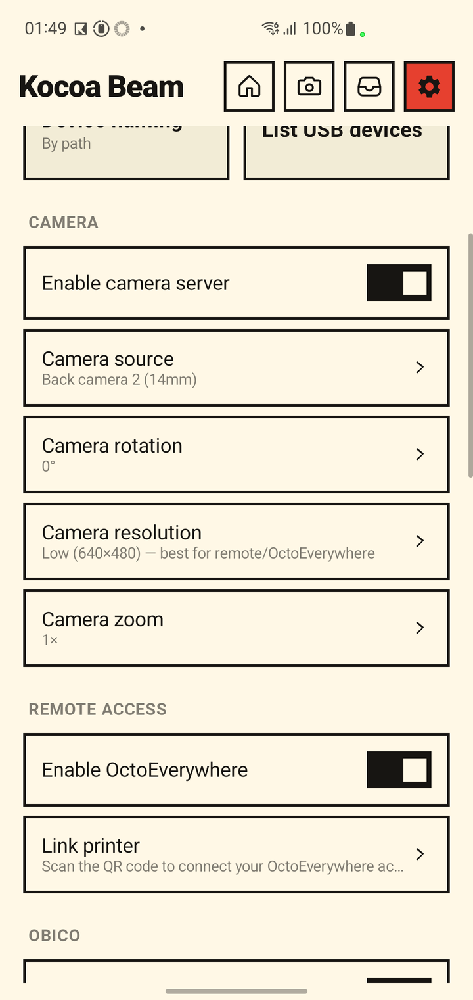
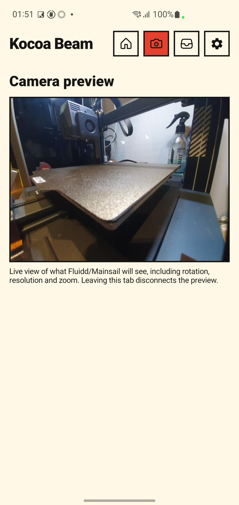
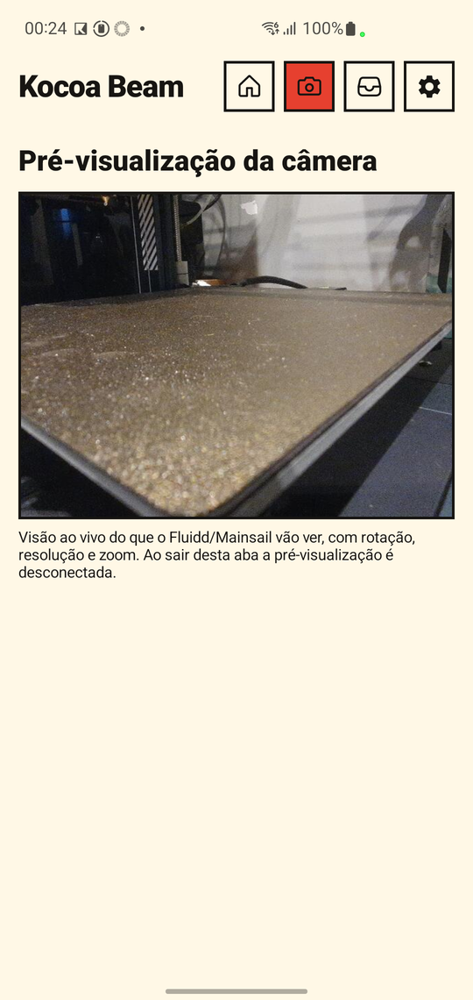
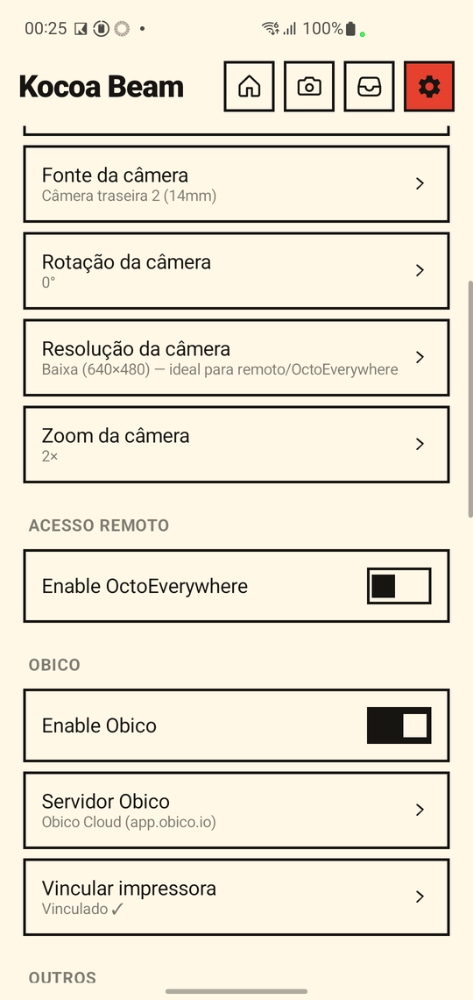
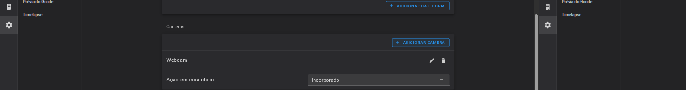
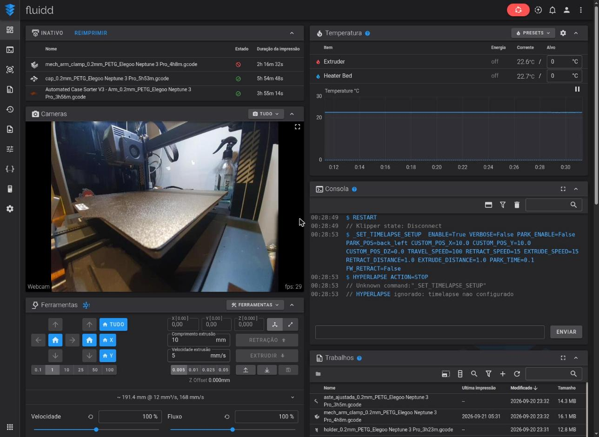
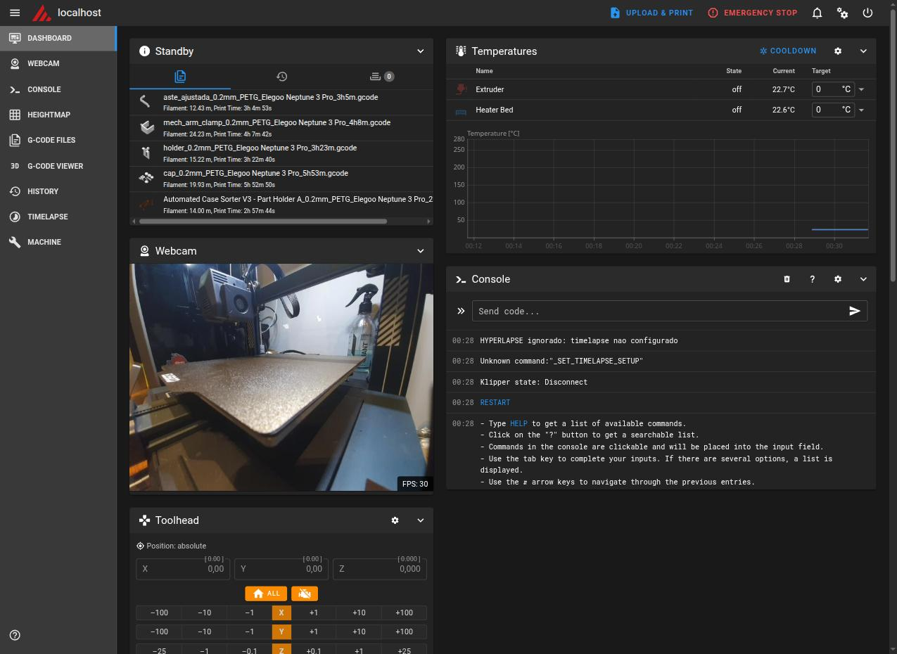

# Usando a câmera / webcam USB

**Idiomas: [English](../webcam.md) · [Português (BR)](webcam.md) · [简体中文](../zh-Hans/webcam.md)**

O Kocoa Beam consegue transmitir uma imagem de câmera ao vivo para
monitorar a impressão — a câmera do próprio aparelho, ou uma webcam USB
UVC conectada via OTG/hub.

## Ativando

1. **Configurações → Câmera → Ativar servidor de câmera.**
2. **Fonte da câmera** deixa você escolher qual câmera usar:
   - **Automático** (padrão) — prioriza uma webcam USB conectada sobre a
     câmera embutida, e troca ao vivo se você conectar/desconectar uma
     enquanto o servidor está rodando.
   - Ou fixe uma câmera específica. Em aparelhos com várias lentes por
     lado (principal/ultra-wide/telefoto atrás, às vezes duas na frente),
     cada uma aparece listada separadamente com a distância focal
     equivalente a 35mm — ex.: "Câmera traseira 1 (26mm)" vs "Câmera
     traseira 2 (14mm)" — o mesmo número usado na propaganda do seu
     celular, então dá pra diferenciar de verdade.
3. **Rotação da câmera** alterna entre 0°/90°/180°/270°, para um celular
   montado de lado ou de cabeça para baixo.

A imagem é servida em `http://<ip-do-aparelho>:8889/` (stream) e
`http://<ip-do-aparelho>:8889/snapshot` (JPEG único), independente da
porta que o Fluidd/Mainsail estejam usando.

### Aba de pré-visualização ao vivo

Com o servidor de câmera ativado, uma **aba de câmera** aparece na barra
superior, ao lado de Logs. Ela mostra a transmissão ao vivo — exatamente o
que o Fluidd/Mainsail recebem, com rotação, resolução e zoom — para você
conferir o enquadramento sem abrir o navegador. Na primeira vez o app pede a
**permissão da câmera** (também pedida ao ativar o servidor). Sair da aba
desconecta a pré-visualização, então ela não custa nada quando não usada.

 

### Zoom

**Configurações → Câmera → Zoom da câmera** alterna entre os níveis de zoom
(1×, 1,5×, 2×, 3× … até 10×). Só são oferecidos os níveis que a **câmera
selecionada realmente suporta** — ultra-wide, teleobjetiva e webcam USB têm
limites diferentes — e a lista muda ao trocar a fonte da câmera. Se a câmera
não tiver zoom, a linha mostra "Não suportado". Alterar o zoom reinicia o
servidor de câmera rapidamente.

### Suporte a webcam USB

Isso depende do aparelho expor a webcam USB pela API Camera2 padrão do
Android como câmera externa (`LENS_FACING_EXTERNAL`), suportada pela
maioria dos aparelhos baseados em AOSP desde o Android 9, mas que algumas
camadas de câmera de fabricantes não expõem. **Confirmado em hardware
real:** um Galaxy S10+ da Samsung (One UI, Android 12) detecta
corretamente uma webcam USB UVC no nível do sistema/USB, mas **não** a
expõe pela Camera2 — o HAL de câmera da Samsung não implementa o provedor
de câmera externa. O app volta para a câmera embutida sem problemas nesse
caso; aparelhos mais próximos do AOSP puro (Pixel, algumas TV boxes/
tablets Android) devem de fato expor a webcam.

## Adicionando no Fluidd ou Mainsail

Fluidd e Mainsail leem a lista de webcams do mesmo lugar — a config de
webcam do próprio Moonraker para aquele perfil — então você só precisa
adicionar **uma vez**, em qualquer um dos dois, e aparece nos dois.

**No Fluidd:** ícone de engrenagem (Configurações) → **Cameras** → **+
Adicionar Camera**:

| Campo | Valor |
|---|---|
| Nome | qualquer um, ex.: "Webcam USB" |
| Service | `MJPEG-Streamer` |
| Stream URL | `http://<ip-do-aparelho>:8889/` |
| Snapshot URL | `http://<ip-do-aparelho>:8889/snapshot` |

Use `127.0.0.1` só se estiver vendo o Fluidd num navegador no próprio
celular; de outro aparelho, use o IP local do celular (o mesmo que já está
na URL do Fluidd/Mainsail).

**No Mainsail:** o formulário equivalente fica em **Machine → Webcams**.
Use o tipo de serviço `UV4L-MJPEG` com as mesmas URLs acima. Como a config
é compartilhada, adicionar no Fluidd já basta — aqui está a mesma webcam
já aparecendo ao vivo no dashboard do Mainsail depois de adicionada uma
vez no Fluidd:

O OctoEverywhere pega essa mesma webcam automaticamente também, assim que
ela estiver configurada aqui — veja [`octoeverywhere.md`](octoeverywhere.md).

## Solução de problemas

- **Fluidd/Mainsail rejeita a webcam / mostra erro, mas a URL do stream
  funciona bem numa aba de navegador comum ou `curl`:** isso era um bug
  real (já corrigido) onde `/snapshot` enviava o `Content-Type` errado.
  Confira se está numa build que já inclui a correção — a resposta deve
  ser `Content-Type: image/jpeg`, não `multipart/x-mixed-replace`.
- **Imagem travando ou lenta especificamente ao ver pelo OctoEverywhere
  (mas normal localmente):** a resolução/qualidade/taxa de quadros padrão
  já são ajustadas para isso (medido ~117KB/s a 640x480/~14fps, contra
  ~1,25MB/s no antigo padrão 720p) — uma conexão retransmitida pela nuvem
  é bem mais limitada em banda do que sua rede local. Se ainda estiver
  lento demais para a sua conexão, ou você quiser mais qualidade, o limite
  de FPS e a resolução podem ser ajustados (`CameraService`/
  `Prefs.cameraWidth`/`cameraHeight` no código-fonte) — ainda sem controle
  na interface para isso.
