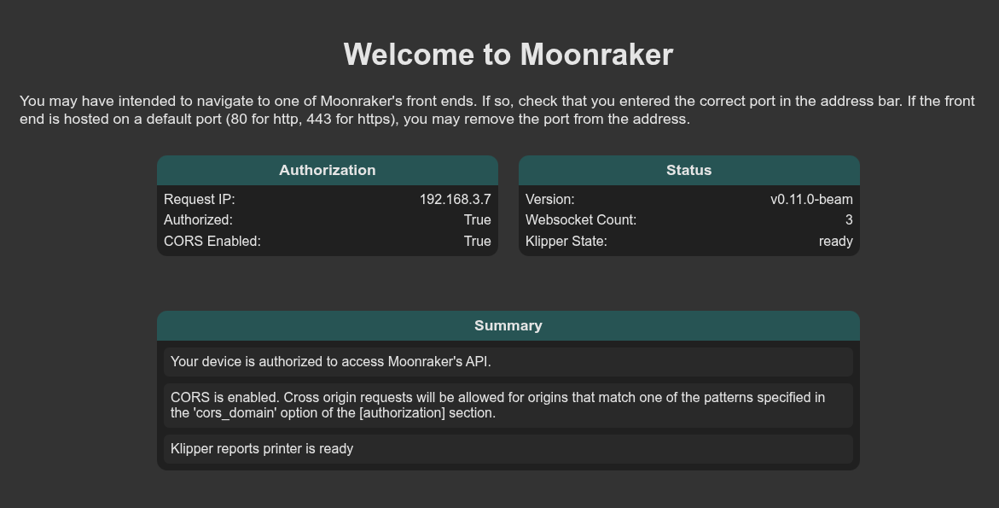
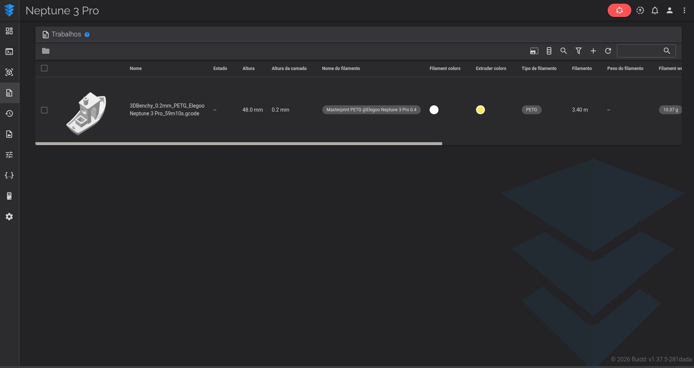

# Update v2

**语言: [English](../whats-new.md) · [Português (BR)](../pt-br/whats-new.md) · [简体中文](whats-new.md)**

本页面概述本项目在基础应用之上所做的变更，面向最终用户和开发者。固件相关见
[build-firmware.md](build-firmware.md)；可选的 Klipper 附加模块见
[mods/klipper-addons.md](mods/klipper-addons.md)。

## 内置软件

打印软件栈已更新到较新的上游 release。确切版本固定在构建中（`gradle.properties` 和
`app/build.gradle`）：

| 组件 | 内置版本 |
|---|---|
| Klipper 主机 | 当前上游（MCU 固件目标：**0.13**） |
| Kalico 主机 | 当前上游 |
| Moonraker | **0.11.0**（Web API 1.5.0） |
| Fluidd | **1.37.5** |
| Mainsail | **2.19.0** |
| Happy Hare（MMU） | **v4.0.0** |
| Moonraker-timelapse | 已内置 |

Fluidd 和 Mainsail 的静态资源以正确的 MIME 类型提供，因此两个前端都能完整加载样式，从网页界面保存文件或配置也能正常工作。

  
  

## 网页界面端口

每个前端有各自的端口，而不是共用一个：

| 前端 | URL |
|---|---|
| Fluidd | `http://<设备-ip>:4408/` |
| Mainsail | `http://<设备-ip>:4409/` |

端口跟随主界面上的前端切换开关，主界面也会显示当前生效的 URL。摄像头端点仍在 `:8889`。

## 摄像头 / USB 摄像头支持

摄像头服务器现在除了设备自带摄像头外，也可以从通用 USB UVC 摄像头推流，支持
实时热插拔切换、能区分多个镜头的选择器，以及旋转控制。完整指南（含如何添加到
Fluidd/Mainsail）：[`webcam.md`](webcam.md)。

## OctoEverywhere 远程访问

**设置 → 远程访问 → 启用 OctoEverywhere** 运行真实的
[OctoEverywhere](https://octoeverywhere.com) Klipper 伴生程序，源码来自上游并
经过改造，以独立进程的形式运行在 Android 上，而不是它通常安装的 systemd 服务
和 venv。它通过与 Fluidd/Mainsail 相同的本地 Moonraker 连接，接入当前正在运行
的打印机配置——Moonraker 一侧无需额外配置。**已在真实硬件上验证端到端可用**，
包括与 octoeverywhere.com 正式生产服务器的关联。

- 打开开关会启动伴生程序；**关联打印机**随后会显示一个二维码（伴生程序生成打印
  机 ID 后即可使用，通常只需几秒钟），用于完成 OctoEverywhere 账号的关联，这与
  其他任何安装方式的一次性步骤相同。如果关联完成后 octoeverywhere.com 上的
  "Go to Klipper" 仍提示未连接，把 OctoEverywhere 关闭再打开一次——它只在连接
  那一刻检查关联状态，不会实时更新。
- 它自带的崩溃遥测（Sentry）已被禁用；与 octoeverywhere.com 的实际远程访问连接
  不受影响。
- 如果你也启用了上面的摄像头服务器，只要在 Fluidd 或 Mainsail 中把它添加为摄像
  头，OctoEverywhere 就能自动使用同一路 USB/内置摄像头画面，无需单独配置摄像头。
  默认的摄像头分辨率/帧率特意调低，以保证在远程连接下仍然可用（实测 640x480、
  约 14fps 时约为 117KB/s，而原来 720p 默认值约为 1.25MB/s——后者慢到会拖慢共
  享同一中继连接的指令执行）。
- 即使同时运行多个打印机配置，同一时间也只有一个配置能关联到 OctoEverywhere。

## 应用内日志查看器

一个 **Logs** 标签页提供 Klipper、Moonraker 和应用日志。每个都可以查看、复制、下载到设备的 `Downloads/` 目录或分享 —— 不需要 PC 或 `adb`。

## g-code 元数据与缩略图

此前不可用，现已修复。上传的任务现在会在 Fluidd/Mainsail 里显示预览图、打印时间、耗材用量和物体列表。Moonraker 通常通过启动一个独立的辅助进程来提取这些信息，而这在 Android 应用内不可行；提取过程被改为在进程内运行。

## 起步 printer.cfg 模板

提供一份 `printer.cfg` 模板，带一个宏包，覆盖 `PRINT_START` / `PRINT_END`、自适应网床、pressure advance 和速度校准、babystepping、换料装卸和预热。

## 内置的 Klipper 附加模块（可选启用）

已随包附带，但在 `printer.cfg` 中加入对应 section 之前处于非激活状态：KAMP、LED Effect、Z Calibration、Auto Speed、TMC Autotune。见
[mods/klipper-addons.md](mods/klipper-addons.md)。无加速度计调 input shaper 的步骤见
[mods/input-shaper-manual.md](mods/input-shaper-manual.md)。

## 崩溃日志

意外退出时，应用会写入 `last_crash.txt` 以便事后检查。

## MCU 固件

针对任意受支持主板的构建工具记录在 [build-firmware.md](build-firmware.md)。

## 未测试

摄像头扩展（`[beam_camera]` —— 手电筒和自动对焦控制）原样保留，本项目未对其进行测试。
